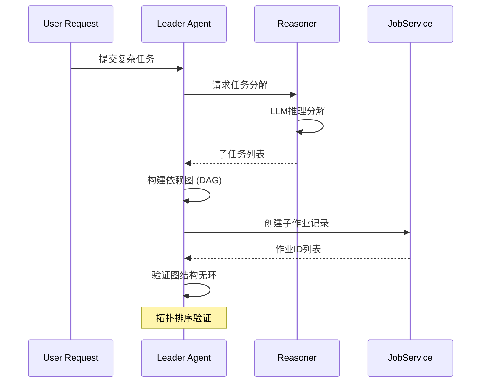
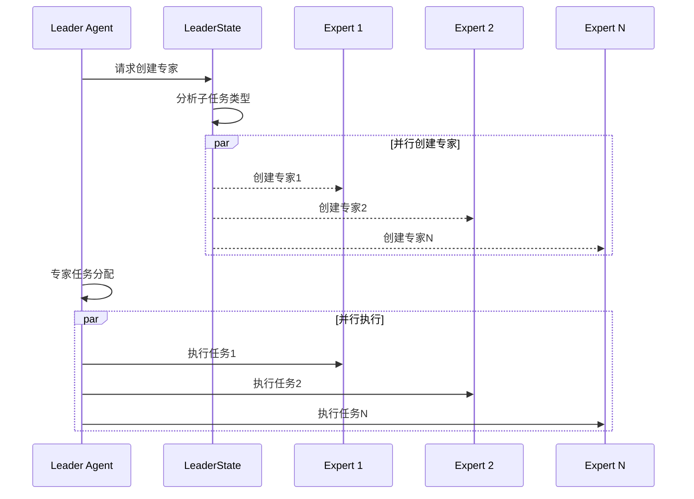
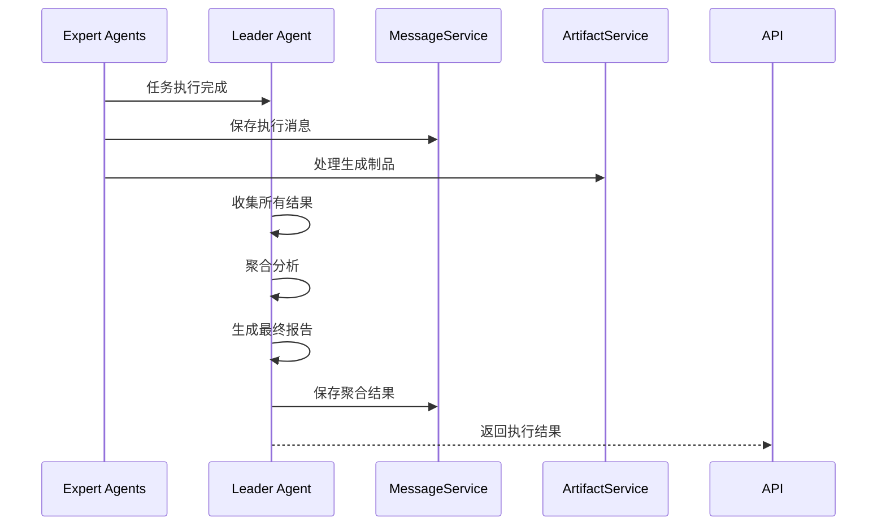

# 智能体模块详解 (Agent Module Deep Dive)

## 职责与边界 (Responsibilities & Boundaries)

智能体模块是 Chat2Graph 系统的**核心协调层**，负责将复杂任务分解为可执行的子任务，并通过多智能体协作完成整体目标。该模块采用**一主多从架构 (One-Active-Many-Passive Architecture)**，实现了清晰的职责分工和高效的并发执行。

### 核心职责 (Core Responsibilities)

#### 1. Leader Agent (主智能体) - `app/core/agent/leader.py`
- **任务分解 (Task Decomposition)**: 将复杂用户请求分解为独立的子任务
- **依赖分析 (Dependency Analysis)**: 构建任务间的依赖关系图 (DAG)
- **专家调度 (Expert Scheduling)**: 动态创建和管理 Expert Agent
- **并发执行 (Concurrent Execution)**: 协调多个 Expert 的并行执行
- **结果聚合 (Result Aggregation)**: 收集和整合各专家的执行结果
- **错误处理 (Error Handling)**: 实现重试机制和失败恢复策略

#### 2. Expert Agent (专家智能体) - `app/core/agent/expert.py`
- **专业化执行 (Specialized Execution)**: 执行特定领域的任务
- **工作流管理 (Workflow Management)**: 管理任务的工作流状态转换
- **状态汇报 (Status Reporting)**: 向 Leader 汇报执行进度和结果
- **记忆集成 (Memory Integration)**: 与增强记忆系统协作
- **制品管理 (Artifact Management)**: 处理任务生成的各类制品

### 边界定义 (Boundary Definitions)

```
┌─────────────────────────────────────────────┐
│              智能体模块边界                    │
│                                             │
│  ┌─────────────┐    ┌─────────────────────┐ │
│  │Leader Agent │    │   Expert Agents     │ │
│  │             │    │                     │ │
│  │ • 任务分解    │◄──►│ • 工作流执行         │ │
│  │ • 专家调度    │    │ • 状态管理          │ │
│  │ • 结果聚合    │    │ • 记忆集成          │ │
│  └─────────────┘    └─────────────────────┘ │
│                                             │
└─────────────────────────────────────────────┘
           ▲                    ▲
           │                    │
    ┌─────────┐           ┌─────────┐
    │推理模块   │           │工作流模块 │
    │Reasoner │           │Workflow │
    └─────────┘           └─────────┘
```

**边界原则**:
- **向上**: 接收来自 API 层的用户请求
- **向下**: 调用推理器、工作流、服务等底层组件
- **横向**: 智能体间通过消息和共享状态通信
- **外部**: 不直接访问数据库，通过服务层间接访问

## 设计模式与核心逻辑 (Design Patterns & Core Logic)

### 1. 模板方法模式 (Template Method Pattern)

#### 基类设计 - `app/core/agent/agent.py:44-137`
```python
class Agent(ABC):
    """Agent implementation following Template Method Pattern"""
    
    def __init__(self, agent_config: AgentConfig, id: Optional[str] = None):
        self._id = id or agent_config.profile.name + "_id"
        self._profile = agent_config.profile
        self._workflow = agent_config.workflow
        self._reasoner = agent_config.reasoner
        # 服务注入 (Dependency Injection)
        self._message_service = MessageService.instance
        self._job_service = JobService.instance
        self._artifact_service = ArtifactService.instance
    
    @abstractmethod
    def execute(self, agent_message: AgentMessage, retry_count: int = 0) -> Any:
        """Template method - 由子类实现具体执行逻辑"""
```

**设计优势**:
- **统一接口**: 所有智能体遵循相同的执行模板
- **服务注入**: 通过单例模式注入核心服务
- **配置驱动**: 基于 `AgentConfig` 的灵活配置

### 2. 状态模式 (State Pattern) - Leader 状态管理

#### 状态抽象 - `app/core/agent/leader_state.py:8-37`
```python
class LeaderState(ABC):
    """State pattern for Leader Agent expert management"""
    
    @abstractmethod
    async def get_experts(self, leader: "Leader") -> List["Expert"]:
        """Get available experts for task execution"""
    
    @abstractmethod
    async def create_expert(self, leader: "Leader", subjob: Job) -> "Expert":
        """Create expert for specific subjob"""
```

#### 具体状态实现 - `app/core/agent/builtin_leader_state.py:12-82`
```python
class BuiltinLeaderState(LeaderState):
    """Built-in state implementation with dynamic expert creation"""
    
    async def create_expert(self, leader: "Leader", subjob: Job) -> "Expert":
        expert_config = AgentConfig(
            profile=Profile(
                name=f"expert_{subjob.name}_{uuid4().hex[:8]}",
                description="Expert agent for specialized task execution"
            ),
            reasoner=leader._reasoner,  # 复用 Leader 的推理器
            workflow=leader._workflow   # 复用 Leader 的工作流
        )
        return Expert(expert_config)
```

**设计亮点**:
- **动态创建**: 根据子任务需求动态创建专家
- **资源复用**: 专家复用 Leader 的推理器和工作流配置
- **唯一标识**: 使用 UUID 确保专家实例的唯一性

### 3. 图算法优化 (Graph Algorithm Optimization)

#### 作业图构建与执行 - `app/core/agent/leader.py:88-245`
```python
async def execute_job_graph(self, job_graph: nx.DiGraph, session_id: str) -> List[Job]:
    """Execute job graph with optimized parallel processing"""
    
    # 1. 拓扑排序确定执行顺序
    try:
        execution_order = list(nx.topological_sort(job_graph))
    except nx.NetworkXError as e:
        raise ValueError(f"Job graph contains cycles: {e}")
    
    completed_jobs: Set[str] = set()
    failed_jobs: Set[str] = set()
    
    # 2. 按层并行执行
    while len(completed_jobs) + len(failed_jobs) < len(job_graph.nodes):
        # 找到所有依赖已满足的作业
        ready_jobs = [
            job_id for job_id in execution_order
            if job_id not in completed_jobs 
            and job_id not in failed_jobs
            and all(pred in completed_jobs for pred in job_graph.predecessors(job_id))
        ]
        
        if not ready_jobs:
            break  # 无法继续执行，可能存在循环依赖
        
        # 3. 并发执行就绪作业
        tasks = []
        for job_id in ready_jobs:
            job_node = job_graph.nodes[job_id]['job']
            expert = await self._state.create_expert(self, job_node)
            task = asyncio.create_task(self._execute_single_job(expert, job_node))
            tasks.append((job_id, task))
        
        # 4. 等待并处理结果
        for job_id, task in tasks:
            try:
                result = await task
                completed_jobs.add(job_id)
                logger.info(f"Job {job_id} completed successfully")
            except Exception as e:
                failed_jobs.add(job_id)
                logger.error(f"Job {job_id} failed: {e}")
```

**算法优势**:
- **DAG 验证**: 使用拓扑排序检测循环依赖
- **层次化执行**: 按依赖层级组织并行执行
- **故障隔离**: 单个作业失败不影响无关作业
- **动态调度**: 实时计算可执行作业集合

### 4. 并发控制模式 (Concurrency Control Pattern)

#### 线程池执行 - `app/core/agent/leader.py:247-288`
```python
def _execute_experts_concurrently(self, expert_tasks: List[Tuple[str, Job, Expert]]) -> List[Job]:
    """Execute multiple experts concurrently using ThreadPoolExecutor"""
    
    def execute_expert_sync(expert_info: Tuple[str, Job, Expert]) -> Job:
        job_id, job, expert = expert_info
        try:
            # 创建 agent 消息
            agent_message = AgentMessage(
                job_id=job.id,
                payload=job.goal + job.context,
                workflow_messages=[],
            )
            
            # 同步执行专家任务
            result = expert.execute(agent_message)
            logger.info(f"Expert for job {job_id} completed")
            return job
            
        except Exception as e:
            logger.error(f"Expert execution failed for job {job_id}: {e}")
            raise
    
    # 使用线程池并行执行
    with ThreadPoolExecutor(max_workers=min(len(expert_tasks), 4)) as executor:
        future_to_job = {
            executor.submit(execute_expert_sync, task): task[1] 
            for task in expert_tasks
        }
        
        completed_jobs = []
        for future in as_completed(future_to_job):
            job = future_to_job[future]
            try:
                result_job = future.result()
                completed_jobs.append(result_job)
            except Exception as e:
                logger.error(f"Job {job.id} execution failed: {e}")
                # 可以在这里实现重试逻辑
        
        return completed_jobs
```

**并发设计特点**:
- **线程池管理**: 限制并发数量，避免资源耗尽
- **异常隔离**: 单个专家异常不影响其他专家执行
- **结果收集**: 使用 `as_completed` 及时处理完成的任务
- **资源清理**: 自动释放线程池资源

## 关键接口/类/函数 (Key Interfaces/Classes/Functions)

### 1. 核心类层次结构

#### AgentConfig - `app/core/agent/agent.py:29-42`
```python
@dataclass
class AgentConfig:
    """智能体配置数据类"""
    profile: Profile          # 智能体档案信息
    reasoner: Reasoner       # 推理器实例
    workflow: Workflow       # 工作流实例
```

**用途**: 智能体创建时的配置参数，支持依赖注入和组件复用。

#### Profile - `app/core/agent/agent.py:16-26`
```python
@dataclass
class Profile:
    """智能体档案信息"""
    name: str                # 智能体名称
    description: str = ""    # 功能描述
```

**用途**: 智能体身份标识，便于日志追踪和调试。

### 2. 关键方法详解

#### Leader.execute() - 主控执行逻辑
```python
def execute(self, agent_message: AgentMessage, retry_count: int = 0) -> str:
    """
    Leader 智能体主执行方法
    
    Args:
        agent_message: 用户请求消息
        retry_count: 重试次数
        
    Returns:
        str: 执行结果摘要
        
    Flow:
        1. 任务分解 → 2. 专家创建 → 3. 并发执行 → 4. 结果聚合
    """
```

**核心流程**:
1. **任务分解**: 调用推理器分解复杂任务
2. **图构建**: 基于依赖关系构建作业 DAG
3. **专家调度**: 为每个子任务创建专门的 Expert
4. **并发执行**: 使用线程池并行执行独立任务
5. **结果聚合**: 收集所有专家结果并生成最终报告

#### Expert.execute() - 专家执行逻辑
```python
def execute(self, agent_message: AgentMessage, retry_count: int = 0) -> AgentMessage:
    """
    Expert 智能体执行方法
    
    Args:
        agent_message: 任务消息
        retry_count: 重试次数
        
    Returns:
        AgentMessage: 包含执行结果的消息
        
    Features:
        - 工作流状态管理
        - 自动重试机制  
        - 记忆系统集成
        - 制品生命周期管理
    """
```

**执行特点**:
- **状态转换**: 管理工作流从 INIT → RUNNING → COMPLETED 的状态流转
- **重试机制**: 支持指数退避的自动重试策略
- **记忆钩子**: 集成 MemFuse 记忆系统的前后置钩子
- **制品处理**: 自动处理临时制品的持久化和清理

### 3. 状态管理接口

#### LeaderState - 状态管理抽象
```python
class LeaderState(ABC):
    @abstractmethod
    async def get_experts(self, leader: "Leader") -> List["Expert"]:
        """获取可用专家列表"""
    
    @abstractmethod  
    async def create_expert(self, leader: "Leader", subjob: Job) -> "Expert":
        """为特定子任务创建专家"""
```

**设计意图**:
- **策略模式**: 不同的专家管理策略可以通过不同的状态实现
- **异步支持**: 专家创建过程支持异步操作
- **扩展性**: 未来可以实现专家池、专家复用等高级特性

## 智能体协作流程 (Agent Collaboration Flow)

### 1. 任务分解流程


### 2. 专家创建与调度


### 3. 结果聚合与汇报


## 错误处理与重试机制 (Error Handling & Retry Mechanism)

### 1. 多层次错误处理

#### Leader 层面错误处理
```python
# app/core/agent/leader.py:88-245
try:
    execution_order = list(nx.topological_sort(job_graph))
except nx.NetworkXError as e:
    # 图结构错误 - 立即失败
    raise ValueError(f"Job graph contains cycles: {e}")

try:
    result = await self._execute_single_job(expert, job_node)
    completed_jobs.add(job_id)
except Exception as e:
    # 单个作业失败 - 记录但继续执行其他作业
    failed_jobs.add(job_id)
    logger.error(f"Job {job_id} failed: {e}")
```

#### Expert 层面重试机制
```python
# app/core/agent/expert.py:35-89
def execute(self, agent_message: AgentMessage, retry_count: int = 0) -> AgentMessage:
    max_retries = 3
    base_delay = 1.0
    
    for attempt in range(max_retries + 1):
        try:
            # 执行工作流
            result = self._workflow.execute(...)
            return self.save_output_agent_message(...)
            
        except Exception as e:
            if attempt < max_retries:
                # 指数退避重试
                delay = base_delay * (2 ** attempt)
                logger.warning(f"Attempt {attempt + 1} failed, retrying in {delay}s: {e}")
                time.sleep(delay)
            else:
                # 最终失败
                logger.error(f"All {max_retries + 1} attempts failed: {e}")
                raise
```

### 2. 异常分类与处理策略

| 异常类型 | 处理策略 | 重试机制 | 影响范围 |
|---------|---------|---------|---------|
| **网络超时** | 指数退避重试 | 是 (3次) | 单个Expert |
| **推理失败** | 记录日志继续 | 是 (3次) | 单个Expert |
| **图结构错误** | 立即失败 | 否 | 整个Leader |
| **内存不足** | 清理后重试 | 是 (1次) | 单个Expert |
| **配置错误** | 立即失败 | 否 | 启动阶段 |

## 性能优化特性 (Performance Optimization Features)

### 1. 并发执行优化
- **线程池限制**: 最大4个并发线程，避免资源竞争
- **任务分组**: 按依赖层级分组，减少等待时间
- **懒创建**: 专家按需创建，减少内存占用

### 2. 内存管理优化  
- **制品清理**: Expert 执行完成后自动清理临时制品
- **消息复用**: 复用 AgentMessage 对象减少内存分配
- **状态清理**: 及时清理完成任务的状态信息

### 3. 网络调用优化
- **异步记忆写入**: 记忆系统写入不阻塞主流程
- **批量操作**: 尽可能使用批量数据库操作
- **连接复用**: 服务层使用单例模式复用数据库连接

## 扩展点与自定义 (Extension Points & Customization)

### 1. 自定义 LeaderState
```python
class CustomLeaderState(LeaderState):
    """自定义专家管理策略"""
    
    def __init__(self):
        self.expert_pool = {}  # 专家池缓存
        self.specialization_map = {}  # 专业化映射
    
    async def create_expert(self, leader: "Leader", subjob: Job) -> "Expert":
        # 实现专家复用逻辑
        expert_key = self._get_expert_key(subjob)
        if expert_key in self.expert_pool:
            return self.expert_pool[expert_key]
        
        # 创建新专家并加入池中
        expert = self._create_specialized_expert(subjob)
        self.expert_pool[expert_key] = expert
        return expert
```

### 2. 自定义 Agent 子类
```python
class SpecializedExpert(Expert):
    """领域专门化的专家智能体"""
    
    def __init__(self, agent_config: AgentConfig, domain: str):
        super().__init__(agent_config)
        self.domain = domain
        
    def execute(self, agent_message: AgentMessage, retry_count: int = 0) -> AgentMessage:
        # 添加领域特定的预处理
        enhanced_message = self._enhance_with_domain_knowledge(agent_message)
        
        # 调用父类执行逻辑
        result = super().execute(enhanced_message, retry_count)
        
        # 添加领域特定的后处理
        return self._post_process_result(result)
```

### 3. 插件式工作流集成
```python
class PluginWorkflowAgent(Agent):
    """支持插件式工作流的智能体"""
    
    def __init__(self, agent_config: AgentConfig, plugins: List[WorkflowPlugin]):
        super().__init__(agent_config)
        self.plugins = plugins
        
    def execute(self, agent_message: AgentMessage, retry_count: int = 0) -> Any:
        # 执行前置插件
        for plugin in self.plugins:
            agent_message = plugin.preprocess(agent_message)
            
        result = self._workflow.execute(...)
        
        # 执行后置插件
        for plugin in reversed(self.plugins):
            result = plugin.postprocess(result)
            
        return result
```

---

## 相关文档链接

- [推理器模块详解](Module-Reasoner.md) - 了解智能体使用的推理引擎
- [工作流模块详解](Module-Workflow.md) - 学习工作流执行机制
- [服务层模块详解](Module-Service.md) - 理解服务层支撑功能
- [代码精粹分析](../Code-Analysis/Highlights.md) - 查看智能体模块的设计亮点