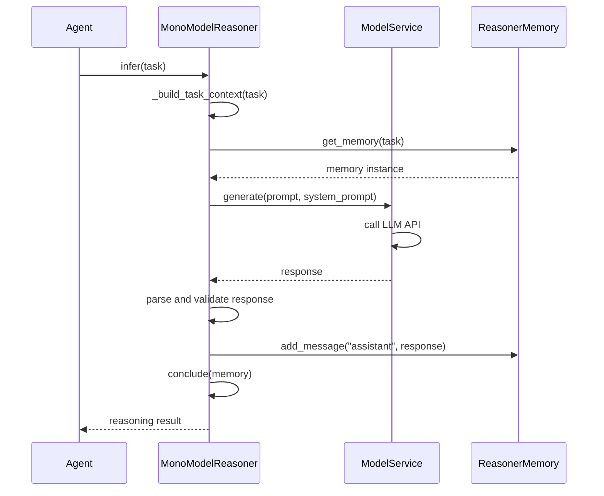
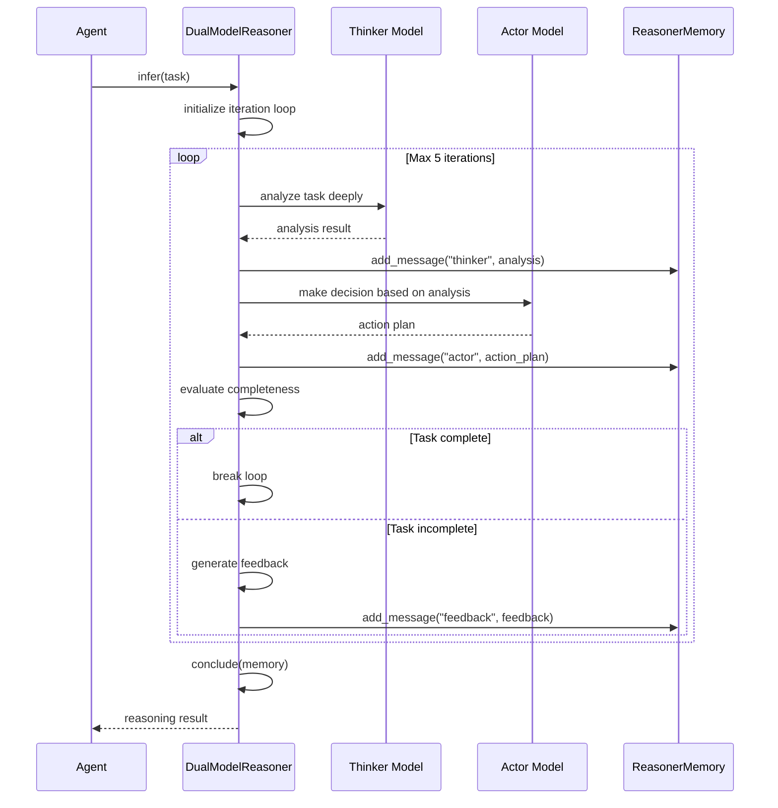
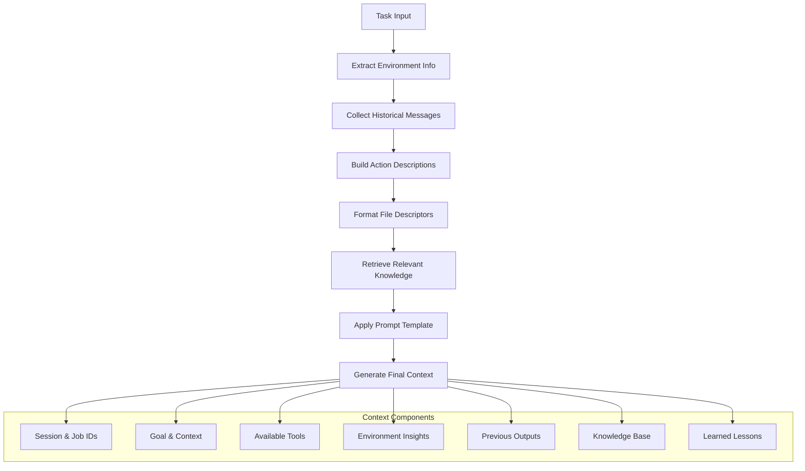

# 推理器模块详解 (Reasoner Module Deep Dive)

## 职责与边界 (Responsibilities & Boundaries)

推理器模块是 Chat2Graph 系统的**核心推理引擎**，负责将自然语言任务转换为结构化的执行计划，并与大语言模型进行交互以生成智能响应。该模块实现了**双模型推理架构 (Dual-Model Reasoning Architecture)**，结合快思考和慢思考模式，为智能体系统提供强大的推理能力。

### 核心职责 (Core Responsibilities)

#### 1. 任务推理与分解 (Task Reasoning & Decomposition)
- **自然语言理解**: 解析用户意图和任务需求
- **任务分解**: 将复杂任务拆分为可执行的子任务
- **依赖分析**: 识别子任务间的依赖关系和执行顺序
- **上下文构建**: 构建包含环境信息、历史记录的推理上下文

#### 2. LLM 交互管理 (LLM Interaction Management)
- **模型服务抽象**: 提供统一的 LLM 访问接口
- **提示工程**: 动态构建系统提示和用户提示
- **响应解析**: 解析和验证 LLM 响应结果
- **会话记忆**: 维护推理过程中的对话历史

#### 3. 双模型协调 (Dual-Model Coordination)
- **Actor-Thinker 模式**: 协调"行动者"和"思考者"两个模型
- **迭代推理**: 实现多轮推理优化
- **决策融合**: 整合双模型的推理结果
- **质量控制**: 评估推理结果的完整性和准确性

### 边界定义 (Boundary Definitions)

```
┌─────────────────────────────────────────────────┐
│                推理器模块边界                      │
│                                                │
│ ┌─────────────────┐    ┌─────────────────────┐  │
│ │  MonoModel      │    │   DualModel         │  │
│ │  Reasoner       │    │   Reasoner          │  │
│ │                 │    │                     │  │
│ │ • 单轮推理       │    │ • Actor-Thinker     │  │
│ │ • 快速响应       │    │ • 迭代优化          │  │
│ │ • 简单任务       │    │ • 复杂推理          │  │
│ └─────────────────┘    └─────────────────────┘  │
│           │                      │              │
│           └──────────┬──────────┘              │
│                      │                         │
│            ┌─────────────────┐                 │
│            │  ReasonerMemory │                 │
│            │                 │                 │
│            │ • 会话历史       │                 │
│            │ • 消息管理       │                 │
│            │ • 状态维护       │                 │
│            └─────────────────┘                 │
└─────────────────────────────────────────────────┘
           ▲                    ▲
           │                    │
    ┌─────────┐           ┌─────────┐
    │模型服务   │           │智能体     │
    │ModelSvc │           │Agent    │
    └─────────┘           └─────────┘
```

**边界原则**:
- **向上**: 为智能体提供推理能力，不直接处理用户请求
- **向下**: 调用模型服务进行 LLM 交互，管理推理记忆
- **横向**: 与工作流、知识库模块协作，获取上下文信息
- **内部**: 维护推理状态和会话记忆的一致性

## 设计模式与核心逻辑 (Design Patterns & Core Logic)

### 1. 策略模式 (Strategy Pattern) - 推理策略选择

#### 推理器基类 - `app/core/reasoner/reasoner.py:9-85`
```python
class Reasoner(ABC):
    """Base Reasoner, an env element of the multi-agent system."""
    
    def __init__(self):
        self._memories: Dict[str, Dict[str, Dict[str, ReasonerMemory]]] = {}
        # 三层嵌套: session_id -> job_id -> operator_id -> memory
    
    @abstractmethod
    async def infer(self, task: Task) -> str:
        """核心推理方法 - 策略模式的策略接口"""
    
    @abstractmethod 
    async def conclude(self, reasoner_memory: ReasonerMemory) -> str:
        """结论生成 - 不同策略有不同的结论逻辑"""
```

**设计优势**:
- **统一接口**: 所有推理器实现相同的抽象接口
- **可替换性**: 可以根据任务复杂度选择不同的推理策略
- **扩展性**: 易于添加新的推理算法（如三模型、强化学习推理等）

### 2. 模板方法模式 (Template Method Pattern) - 推理流程标准化

#### 上下文构建模板 - `app/core/reasoner/reasoner.py:41-84`
```python
def _build_task_context(self, task: Task) -> str:
    """构建任务上下文的标准模板"""
    
    # 1. 环境信息处理
    if task.insights:
        env_info = "\n".join([f"{insight}" for insight in task.insights])
    else:
        env_info = "No environment information provided in this round."
    
    # 2. 历史输入处理
    if task.workflow_messages:
        previous_input = "\n".join(
            [f"{workflow_message.scratchpad}" for workflow_message in task.workflow_messages]
        )
    else:
        previous_input = "No previous input provided in this round."
    
    # 3. 可用工具信息
    action_rels = "\n".join(
        [f"[action {action.name}: {action.description}] -next-> " for action in task.actions]
    )
    
    # 4. 文件描述信息
    file_desc = (
        "\n".join(f"File name: {f.name} - File id: {f.id}" for f in (task.file_descriptors or []))
        or "No files provided in this round."
    )
    
    # 5. 使用模板生成最终上下文
    return TASK_DESCRIPTOR_PROMPT_TEMPLATE.format(
        action_rels=action_rels,
        context=task.job.goal + task.job.context,
        session_id=task.job.session_id,
        job_id=task.job.id,
        file_descriptors=file_desc,
        env_info=env_info,
        knowledge=task.knowledge.get_payload() if task.knowledge else "",
        previous_input=previous_input,
        lesson=task.lesson or "No lesson learned in this round.",
    )
```

**模板方法优势**:
- **标准化流程**: 确保所有推理器使用相同的上下文构建逻辑
- **信息完整性**: 系统性地收集和组织所有相关信息
- **可维护性**: 上下文格式变更只需修改一处
- **调试友好**: 标准化的上下文便于问题追踪

### 3. 工厂模式 (Factory Pattern) - 模型服务创建

#### 模型服务工厂 - `app/core/reasoner/model_service_factory.py:10-47`
```python
class ModelServiceFactory:
    """Factory for creating model services with different backends"""
    
    @staticmethod
    def create_model_service(platform_type: str, model_config: Dict[str, Any]) -> ModelService:
        """
        Create model service based on platform type
        
        Args:
            platform_type: "AISUITE" | "LITELLM" | "OPENAI" | ...
            model_config: Configuration parameters
            
        Returns:
            ModelService: Configured model service instance
        """
        
        if platform_type == "AISUITE":
            from app.plugin.aisuite import AISuiteModelService
            return AISuiteModelService(model_config)
            
        elif platform_type == "LITELLM":
            from app.plugin.lite_llm import LiteLLMModelService  
            return LiteLLMModelService(model_config)
            
        else:
            raise ValueError(f"Unsupported platform type: {platform_type}")
```

**工厂模式优势**:
- **插件化**: 支持多种 LLM 服务提供商
- **配置驱动**: 通过配置选择模型服务实现
- **松耦合**: 推理器不依赖具体的模型服务实现
- **易于扩展**: 添加新的模型服务提供商很简单

### 4. 双模型协调模式 (Dual-Model Coordination Pattern)

#### DualModelReasoner 设计 - `app/core/reasoner/dual_model_reasoner.py:15-156`
```python
class DualModelReasoner(Reasoner):
    """Dual-model reasoning with Actor-Thinker pattern"""
    
    def __init__(self, thinker_model: ModelService, actor_model: ModelService):
        super().__init__()
        self.thinker = thinker_model    # 深度思考模型
        self.actor = actor_model        # 快速行动模型
        self.max_iterations = 5         # 最大迭代次数
        
    async def infer(self, task: Task) -> str:
        """双模型协作推理流程"""
        memory = self.get_memory(task)
        
        for iteration in range(self.max_iterations):
            # Phase 1: Thinker 深度分析
            analysis = await self._thinker_analyze(task, memory)
            memory.add_message("thinker", analysis)
            
            # Phase 2: Actor 快速决策
            action_plan = await self._actor_decide(task, memory, analysis)
            memory.add_message("actor", action_plan)
            
            # Phase 3: 评估是否完成
            if self._is_task_complete(action_plan):
                break
                
            # Phase 4: 反馈优化
            feedback = await self._generate_feedback(analysis, action_plan)
            memory.add_message("feedback", feedback)
        
        # 生成最终结论
        return await self.conclude(memory)
    
    async def _thinker_analyze(self, task: Task, memory: ReasonerMemory) -> str:
        """Thinker 模型进行深度分析"""
        context = self._build_task_context(task)
        history = memory.get_formatted_history()
        
        prompt = f"""
        作为深度思考者，请分析以下任务：
        
        {context}
        
        历史对话：
        {history}
        
        请提供：
        1. 任务分解策略
        2. 潜在风险分析  
        3. 执行建议
        """
        
        return await self.thinker.generate(prompt)
    
    async def _actor_decide(self, task: Task, memory: ReasonerMemory, analysis: str) -> str:
        """Actor 模型进行快速决策"""
        tools = self._build_func_description(task)
        
        prompt = f"""
        基于深度分析结果，制定具体的行动计划：
        
        分析结果：{analysis}
        
        可用工具：{tools}
        
        请生成具体的执行步骤和工具调用。
        """
        
        return await self.actor.generate(prompt, functions=task.tools)
```

**双模型模式优势**:
- **角色分工**: Thinker 负责深度分析，Actor 负责快速决策
- **迭代优化**: 通过多轮交互不断优化推理结果
- **质量平衡**: 兼顾推理深度和执行效率
- **容错机制**: 多次迭代提高推理的鲁棒性

## 关键接口/类/函数 (Key Interfaces/Classes/Functions)

### 1. 核心推理接口

#### Reasoner 抽象基类
```python
class Reasoner(ABC):
    """推理器抽象基类 - 定义推理的标准契约"""
    
    @abstractmethod
    async def infer(self, task: Task) -> str:
        """
        核心推理方法
        
        Args:
            task: 包含完整任务信息的 Task 对象
            
        Returns:
            str: 推理结果（通常是结构化的执行计划）
        """
    
    @abstractmethod
    async def update_knowledge(self, data: Any) -> None:
        """
        更新推理器的知识库
        
        Args:
            data: 新的知识数据
        """
    
    @abstractmethod
    async def evaluate(self, data: Any) -> Any:
        """
        评估推理结果的质量
        
        Args:
            data: 需要评估的推理结果
            
        Returns:
            评估结果（可以是分数、等级或详细反馈）
        """
```

### 2. 记忆管理系统

#### ReasonerMemory - `app/core/memory/reasoner_memory.py:8-120`
```python
class ReasonerMemory:
    """推理器记忆管理 - 维护会话历史和状态"""
    
    def __init__(self, session_id: str, job_id: str, operator_id: str):
        self.session_id = session_id
        self.job_id = job_id
        self.operator_id = operator_id
        self.messages: List[Dict[str, Any]] = []
        self.metadata: Dict[str, Any] = {}
        
    def add_message(self, role: str, content: str, **kwargs) -> None:
        """
        添加消息到记忆中
        
        Args:
            role: 消息角色 ("user", "assistant", "thinker", "actor")
            content: 消息内容
            **kwargs: 额外的消息元数据
        """
        message = {
            "role": role,
            "content": content,
            "timestamp": datetime.now().isoformat(),
            "metadata": kwargs
        }
        self.messages.append(message)
    
    def get_messages_by_role(self, role: str) -> List[Dict[str, Any]]:
        """根据角色筛选消息"""
        return [msg for msg in self.messages if msg["role"] == role]
    
    def get_formatted_history(self, max_messages: int = 10) -> str:
        """
        获取格式化的对话历史
        
        Args:
            max_messages: 最多返回的消息数量
            
        Returns:
            str: 格式化的对话历史字符串
        """
        recent_messages = self.messages[-max_messages:]
        formatted = []
        
        for msg in recent_messages:
            role = msg["role"]
            content = msg["content"]
            timestamp = msg["timestamp"]
            formatted.append(f"[{timestamp}] {role}: {content}")
        
        return "\n".join(formatted)
```

**记忆系统特点**:
- **分层存储**: session → job → operator 三层隔离
- **角色管理**: 支持多种消息角色，便于区分不同来源
- **元数据支持**: 每条消息可携带额外的元数据信息
- **历史检索**: 支持按角色、时间等维度检索历史消息

### 3. 模型服务抽象

#### ModelService - `app/core/reasoner/model_service.py:10-67`
```python
class ModelService(ABC):
    """模型服务抽象接口 - 统一不同 LLM 提供商的访问方式"""
    
    @abstractmethod
    async def generate(self, 
                      prompt: str, 
                      system_prompt: Optional[str] = None,
                      functions: Optional[List[Any]] = None,
                      **kwargs) -> str:
        """
        生成文本响应
        
        Args:
            prompt: 用户提示词
            system_prompt: 系统提示词
            functions: 可用的函数列表（用于 Function Calling）
            **kwargs: 额外的生成参数
            
        Returns:
            str: 生成的响应文本
        """
    
    @abstractmethod
    async def generate_embedding(self, text: str) -> List[float]:
        """
        生成文本嵌入向量
        
        Args:
            text: 输入文本
            
        Returns:
            List[float]: 嵌入向量
        """
    
    def get_model_info(self) -> Dict[str, Any]:
        """获取模型信息"""
        return {
            "provider": self.__class__.__name__,
            "model_name": getattr(self, "model_name", "unknown"),
            "max_tokens": getattr(self, "max_tokens", None),
        }
```

### 4. 任务上下文构建

#### Task 数据结构
```python
@dataclass
class Task:
    """推理任务的完整上下文信息"""
    
    job: Job                                    # 作业信息
    actions: List[Action]                       # 可用工具/动作
    tools: List[Any]                           # Function calling 工具
    insights: Optional[List[str]] = None        # 环境洞察
    knowledge: Optional[Knowledge] = None       # 相关知识
    lesson: Optional[str] = None               # 历史经验教训
    workflow_messages: Optional[List[WorkflowMessage]] = None  # 工作流消息
    file_descriptors: Optional[List[FileDescriptor]] = None   # 文件描述
```

**Task 设计优势**:
- **信息完整性**: 包含推理所需的所有上下文信息
- **结构化**: 使用 dataclass 确保类型安全
- **可选字段**: 支持不同复杂度的推理任务
- **扩展性**: 可以轻松添加新的上下文字段

## 推理流程详解 (Reasoning Process Deep Dive)

### 1. 单模型推理流程 (MonoModel Reasoning Flow)



**特点**:
- **简单高效**: 单次 LLM 调用完成推理
- **适用场景**: 简单任务、快速响应需求
- **低延迟**: 没有迭代开销

### 2. 双模型推理流程 (DualModel Reasoning Flow)



**特点**:
- **迭代优化**: 通过多轮交互逐步完善推理结果
- **角色分工**: Thinker 负责分析，Actor 负责决策
- **质量保证**: 多轮验证确保推理质量

### 3. 上下文构建流程 (Context Building Process)



## 高级特性与优化 (Advanced Features & Optimizations)

### 1. 提示工程优化 (Prompt Engineering Optimization)

#### 动态提示模板 - `app/core/prompt/model_service.py`
```python
TASK_DESCRIPTOR_PROMPT_TEMPLATE = """
## 任务上下文 (Task Context)

### 基本信息
- 会话ID: {session_id}
- 作业ID: {job_id}
- 任务目标: {context}

### 可用工具 (Available Tools)
{action_rels}

### 相关文件 (Related Files)
{file_descriptors}

### 环境信息 (Environment Information)
{env_info}

### 知识库信息 (Knowledge Base)
{knowledge}

### 历史输入 (Previous Input)
{previous_input}

### 经验教训 (Lessons Learned)
{lesson}

## 推理要求 (Reasoning Requirements)

1. **任务分解**: 将复杂任务分解为具体的执行步骤
2. **工具选择**: 根据任务需求选择合适的工具
3. **依赖管理**: 识别步骤间的依赖关系
4. **错误处理**: 考虑可能的异常情况和处理策略

请基于以上信息进行推理，并生成结构化的执行计划。
"""
```

**模板优势**:
- **结构化**: 清晰的信息组织方式
- **完整性**: 涵盖推理所需的所有信息
- **中英文**: 支持多语言提示
- **可配置**: 模板参数可动态替换

### 2. 记忆优化策略 (Memory Optimization Strategies)

#### 分层记忆管理
```python
class HierarchicalMemoryManager:
    """分层记忆管理器 - 优化内存使用和访问效率"""
    
    def __init__(self):
        # 三层缓存结构
        self.session_cache = {}    # 会话级缓存
        self.job_cache = {}        # 作业级缓存  
        self.operator_cache = {}   # 操作级缓存
        
        # 缓存配置
        self.max_session_size = 100
        self.max_job_size = 50
        self.max_operator_size = 20
    
    def get_memory(self, session_id: str, job_id: str, operator_id: str) -> ReasonerMemory:
        """获取记忆实例，支持多级缓存"""
        cache_key = f"{session_id}:{job_id}:{operator_id}"
        
        # L1: 操作级缓存
        if cache_key in self.operator_cache:
            return self.operator_cache[cache_key]
        
        # L2: 作业级缓存
        job_key = f"{session_id}:{job_id}"
        if job_key in self.job_cache:
            memory = self.job_cache[job_key].get(operator_id)
            if memory:
                self.operator_cache[cache_key] = memory
                return memory
        
        # L3: 会话级缓存
        if session_id in self.session_cache:
            session_memories = self.session_cache[session_id]
            memory = session_memories.get(job_id, {}).get(operator_id)
            if memory:
                self._promote_to_cache(cache_key, job_key, memory)
                return memory
        
        # 创建新的记忆实例
        memory = ReasonerMemory(session_id, job_id, operator_id)
        self._store_memory(session_id, job_id, operator_id, memory)
        return memory
```

### 3. 异步处理优化 (Asynchronous Processing Optimization)

#### 并发推理处理
```python
class ConcurrentReasoningManager:
    """并发推理管理器 - 支持多任务并行推理"""
    
    def __init__(self, max_concurrent: int = 3):
        self.semaphore = asyncio.Semaphore(max_concurrent)
        self.active_tasks = {}
        
    async def infer_concurrent(self, reasoner: Reasoner, tasks: List[Task]) -> List[str]:
        """并发执行多个推理任务"""
        
        async def _infer_with_semaphore(task: Task) -> str:
            async with self.semaphore:
                task_id = f"{task.job.session_id}:{task.job.id}"
                self.active_tasks[task_id] = asyncio.current_task()
                
                try:
                    result = await reasoner.infer(task)
                    return result
                finally:
                    self.active_tasks.pop(task_id, None)
        
        # 创建并发任务
        reasoning_tasks = [_infer_with_semaphore(task) for task in tasks]
        
        # 并发执行并收集结果
        results = await asyncio.gather(*reasoning_tasks, return_exceptions=True)
        
        # 处理异常结果
        processed_results = []
        for i, result in enumerate(results):
            if isinstance(result, Exception):
                logger.error(f"Task {i} failed: {result}")
                processed_results.append(f"Error: {result}")
            else:
                processed_results.append(result)
        
        return processed_results
```

### 4. 质量评估机制 (Quality Assessment Mechanism)

#### 推理结果评估
```python
class ReasoningQualityAssessor:
    """推理质量评估器 - 评估推理结果的质量"""
    
    def __init__(self, evaluator_model: ModelService):
        self.evaluator = evaluator_model
        
    async def evaluate_reasoning(self, task: Task, reasoning_result: str) -> Dict[str, Any]:
        """评估推理结果的质量"""
        
        evaluation_prompt = f"""
        请评估以下推理结果的质量：
        
        原始任务：{task.job.goal}
        推理结果：{reasoning_result}
        
        评估维度：
        1. 完整性 (0-10): 是否完整回答了任务要求
        2. 准确性 (0-10): 推理逻辑是否正确
        3. 可执行性 (0-10): 生成的计划是否可执行
        4. 创新性 (0-10): 解决方案是否具有创新性
        
        请以 JSON 格式返回评估结果：
        {{
            "completeness": <分数>,
            "accuracy": <分数>,
            "executability": <分数>,
            "creativity": <分数>,
            "overall": <总分>,
            "feedback": "<详细反馈>"
        }}
        """
        
        evaluation_result = await self.evaluator.generate(evaluation_prompt)
        
        try:
            return json.loads(evaluation_result)
        except json.JSONDecodeError:
            return {
                "completeness": 0,
                "accuracy": 0, 
                "executability": 0,
                "creativity": 0,
                "overall": 0,
                "feedback": "评估结果解析失败"
            }
```

## 性能优化与监控 (Performance Optimization & Monitoring)

### 1. 推理性能指标
```python
class ReasoningMetrics:
    """推理性能监控指标"""
    
    def __init__(self):
        self.metrics = {
            "total_inferences": 0,
            "avg_inference_time": 0.0,
            "success_rate": 0.0,
            "token_usage": {"input": 0, "output": 0},
            "model_calls": {"thinker": 0, "actor": 0},
        }
    
    def record_inference(self, 
                        inference_time: float,
                        success: bool,
                        token_usage: Dict[str, int],
                        model_calls: Dict[str, int]):
        """记录推理性能数据"""
        self.metrics["total_inferences"] += 1
        
        # 更新平均推理时间
        current_avg = self.metrics["avg_inference_time"]
        total_count = self.metrics["total_inferences"]
        new_avg = (current_avg * (total_count - 1) + inference_time) / total_count
        self.metrics["avg_inference_time"] = new_avg
        
        # 更新成功率
        if success:
            success_count = int(self.metrics["success_rate"] * (total_count - 1)) + 1
        else:
            success_count = int(self.metrics["success_rate"] * (total_count - 1))
        self.metrics["success_rate"] = success_count / total_count
        
        # 更新 Token 使用量
        self.metrics["token_usage"]["input"] += token_usage.get("input", 0)
        self.metrics["token_usage"]["output"] += token_usage.get("output", 0)
        
        # 更新模型调用次数
        for model, count in model_calls.items():
            self.metrics["model_calls"][model] = self.metrics["model_calls"].get(model, 0) + count
```

### 2. 缓存策略
- **上下文缓存**: 相似任务的上下文可以复用
- **响应缓存**: 相同输入的 LLM 响应可以缓存
- **记忆分层**: 不同层级的记忆有不同的缓存策略

### 3. 资源管理
- **连接池**: LLM API 调用使用连接池管理
- **并发控制**: 限制同时进行的推理任务数量
- **内存清理**: 定期清理长期未使用的记忆数据

---

## 相关文档链接

- [智能体模块详解](Module-Agent.md) - 了解推理器与智能体的协作关系
- [工作流模块详解](Module-Workflow.md) - 学习推理结果如何转化为可执行工作流
- [知识库模块详解](Module-Knowledge.md) - 理解推理过程中的知识检索机制
- [代码精粹分析](../Code-Analysis/Highlights.md) - 查看推理器模块的设计亮点