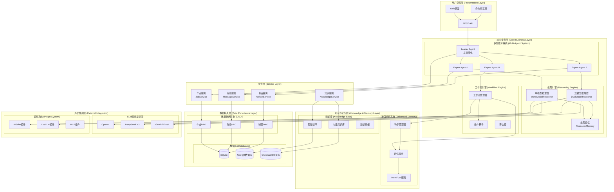
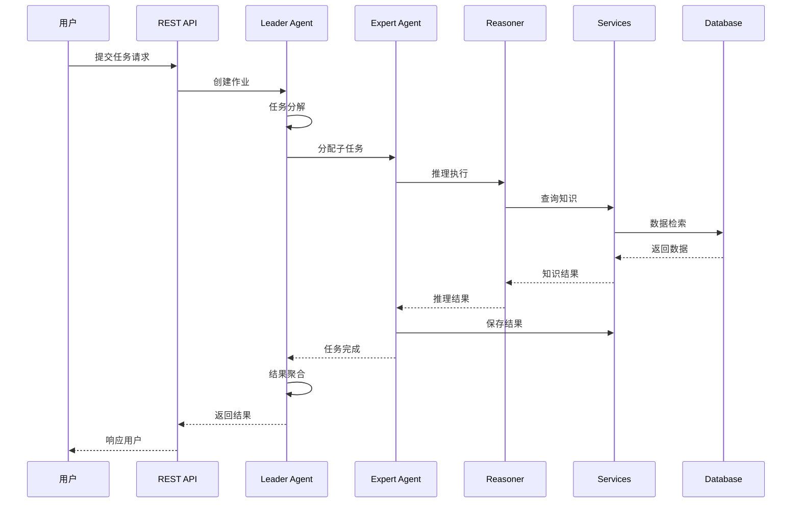
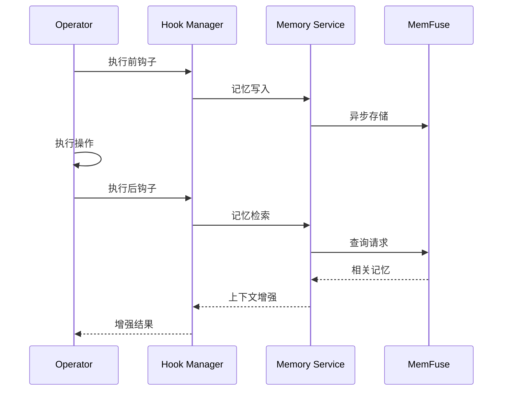

# 架构总览 (Architecture Overview)

## 宏观架构图 (High-Level Architecture Diagram)



## 分层架构说明 (Layered Architecture)

Chat2Graph 采用经典的**四层架构设计 (4-Tier Architecture)**，结合**多智能体系统 (Multi-Agent System)** 和**图原生设计理念 (Graph-Native Design Philosophy)**：

### 1. 用户交互层 (Presentation Layer)
**核心职责**: 处理用户输入、展示结果、协议转换

- **Web 界面**: 基于 Flask 的 Web 应用，提供直观的用户交互体验
- **REST API**: 标准化的 HTTP API 接口，支持第三方系统集成
- **命令行工具**: 开发者友好的 CLI 接口，支持脚本化操作

**设计特点**:
- 无状态设计，便于水平扩展
- 统一错误处理和响应格式
- 支持跨域资源共享 (CORS)

### 2. 核心业务层 (Core Business Layer)
**核心职责**: 实现核心业务逻辑、智能体协调、任务分解

#### 2.1 多智能体系统 (Multi-Agent System)
- **Leader Agent (主智能体)**:
  - 任务分解和作业图构建 (Job Graph Construction)
  - 专家智能体调度和协调
  - 并发执行管理和结果聚合
  - 依赖关系解析 (DAG-based Dependency Resolution)

- **Expert Agents (专家智能体)**:
  - 专门化任务执行
  - 工作流状态管理
  - 重试机制和错误恢复
  - 与记忆系统集成

#### 2.2 推理引擎 (Reasoning Engine)
- **单模型推理器 (MonoModelReasoner)**:
  - 简单直接的单轮推理
  - 适用于确定性任务

- **双模型推理器 (DualModelReasoner)**:
  - Actor-Thinker 模式
  - 快慢思考结合 (Fast-Slow Thinking)
  - 迭代式推理优化

#### 2.3 工作流引擎 (Workflow Engine)
- **动态工作流构建**: 基于 NetworkX 的图结构工作流
- **操作算子**: 可组合的原子操作单元
- **评估机制**: 工作流执行质量评估

### 3. 服务层 (Service Layer)
**核心职责**: 业务服务封装、数据操作抽象、跨模块协调

#### 关键服务 (Key Services):

- **作业服务 (JobService)**:
  - 作业生命周期管理
  - 层级作业关系维护 (原始作业 → 子作业)
  - 状态跟踪和进度监控

- **消息服务 (MessageService)**:
  - 多类型消息持久化
  - 基于作业和会话的消息检索
  - 类型安全的消息转换

- **制品服务 (ArtifactService)**:
  - 临时制品管理
  - 图制品到消息的转换
  - 制品生命周期管理

- **知识服务 (KnowledgeService)**:
  - RAG (Retrieval-Augmented Generation) 查询
  - 多知识源集成
  - 相似性检索优化

**设计模式**: **单例模式 (Singleton Pattern)** + **仓储模式 (Repository Pattern)**

### 4. 数据持久层 (Data Persistence Layer)
**核心职责**: 数据存储、查询优化、事务管理

#### 4.1 数据存储策略:
- **SQLite**: 关系型数据（作业、消息、制品）
- **Neo4j**: 图结构数据（依赖关系、知识图谱）
- **ChromaDB**: 向量数据（嵌入向量、相似性检索）

#### 4.2 数据访问层设计:
- **DAO 模式**: 数据访问对象抽象
- **工厂模式**: 数据访问对象创建
- **连接池**: 数据库连接优化

## 核心架构模式 (Core Architectural Patterns)

### 1. 一主多从混合架构 (One-Active-Many-Passive Hybrid Architecture)
```
Leader Agent (1个主控者)
    ├── 任务分解 (Task Decomposition)
    ├── 依赖分析 (Dependency Analysis)
    ├── 专家调度 (Expert Scheduling)
    └── 结果聚合 (Result Aggregation)

Expert Agents (多个执行者)
    ├── 专业化执行 (Specialized Execution)
    ├── 状态汇报 (Status Reporting)
    └── 协作通信 (Collaborative Communication)
```

**优势**:
- **清晰的责任分工**: 避免智能体间的角色冲突
- **高效的并发执行**: 独立子任务可并行处理
- **良好的容错性**: 单个专家失败不影响整体任务
- **易于扩展**: 可动态添加新的专家类型

### 2. 图原生设计 (Graph-Native Design)
- **作业依赖图**: 使用 NetworkX 构建任务 DAG (Directed Acyclic Graph)
- **知识图谱**: Neo4j 存储实体关系和语义结构
- **工作流图**: 算子间依赖关系的图结构表示

**核心优势**:
- **自然的依赖建模**: 图结构天然表达任务间依赖
- **高效的路径查找**: 图算法优化执行路径
- **直观的可视化**: 图结构便于理解和调试

### 3. 插件化架构 (Plugin-Based Architecture)
```
核心接口 (Core Interfaces)
├── KnowledgeStore (知识存储抽象)
├── ModelService (模型服务抽象)
├── GraphDB (图数据库抽象)
└── Workflow (工作流抽象)

插件实现 (Plugin Implementations)
├── DBGptKnowledgeStore
├── AISuiteModelService
├── Neo4jGraphDB
└── CustomWorkflow
```

**设计优势**:
- **松耦合**: 核心逻辑与具体实现解耦
- **易于扩展**: 新插件可独立开发和部署
- **技术栈灵活**: 支持多种技术栈选择

## 数据流与控制流 (Data Flow & Control Flow)

### 1. 请求处理流程 (Request Processing Flow)


### 2. 记忆系统集成流程 (Memory System Integration Flow)


## 技术决策与权衡 (Technical Decisions & Trade-offs)

### 1. 同步 vs 异步处理
**决策**: 混合模式
- **同步**: 关键路径和状态管理
- **异步**: 记忆写入和外部服务调用

**权衡**:
- ✅ **性能**: 非关键操作不阻塞主流程
- ⚠️ **复杂性**: 需要处理并发和一致性问题

### 2. SQLite vs 分布式数据库
**决策**: SQLite 为主，专用数据库为辅
- **SQLite**: 关系型数据和事务
- **Neo4j/ChromaDB**: 专门化数据存储

**权衡**:
- ✅ **简单性**: 部署和维护成本低
- ⚠️ **扩展性**: 单机数据库存在性能上限

### 3. 单例 vs 依赖注入
**决策**: 单例模式
- **优势**: 简单直接，全局状态管理方便
- **劣势**: 测试难度增加，难以模拟

## 可扩展性考虑 (Scalability Considerations)

### 水平扩展策略:
1. **服务拆分**: 核心组件可独立部署
2. **消息队列**: 异步任务处理
3. **缓存层**: Redis 缓存热点数据
4. **数据库分片**: 按会话或租户分片

### 性能优化点:
1. **连接池**: 数据库连接复用
2. **批量操作**: 减少数据库往返
3. **懒加载**: 按需初始化资源
4. **内存管理**: 及时清理临时数据

---

## 下一步阅读

- [智能体模块详解](Module-Agent.md) - 深入了解多智能体系统设计
- [推理器模块详解](Module-Reasoner.md) - 探索推理引擎架构
- [工作流模块详解](Module-Workflow.md) - 学习工作流编排机制
- [知识库模块详解](Module-Knowledge.md) - 了解知识存储和检索
- [服务层模块详解](Module-Service.md) - 掌握核心业务服务