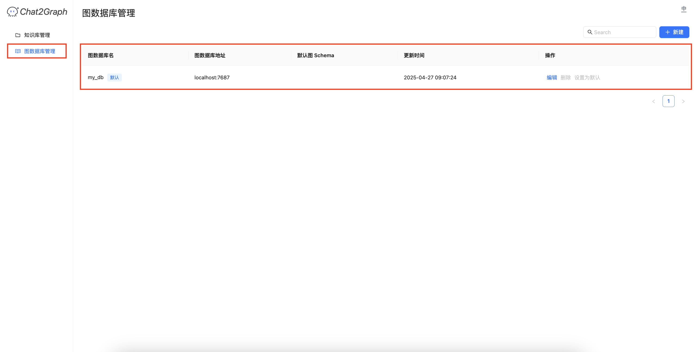

# 图数据库

Chat2Graph 可以与多个图数据库进行交互，并支持对它们的连接进行管理。

+ **导航**： 通过管理侧边栏中的“图数据库管理”链接访问。
+ **搜索栏**： 可按名称或其他条件过滤数据库列表。
+ **新建按钮**： 打开表单或对话框以添加新的图数据库连接。通常需要提供名称、数据库地址（例如 Neo4j 的 localhost:7687）、凭证，以及可能选择默认模式。
+ **数据库列表**： 以表格形式显示已配置的图数据库，包含以下列：
    - **图数据库名称**： 用户定义的连接名称（例如 my_db）。带有“默认”标签表示该数据库在未指定其他选项时将作为默认使用。
    - **图数据库地址**： 数据库实例的网络地址和端口。
    - **默认图模式**：（如适用，显示与此连接关联的默认模式名称）。
    - **最后修改时间**： 连接配置最后一次更新的时戳。
    - **操作**： 对每个数据库连接可用的操作：
        * **编辑**： 修改连接详细信息。
        * **删除**： 移除数据库连接。
        * **设为默认**： 将此数据库连接标记为默认使用的连接。
+ **注意事项**： 在对话中，如需 Chat2Graph 与图数据库顺畅协作，请确保已创建默认图数据库。