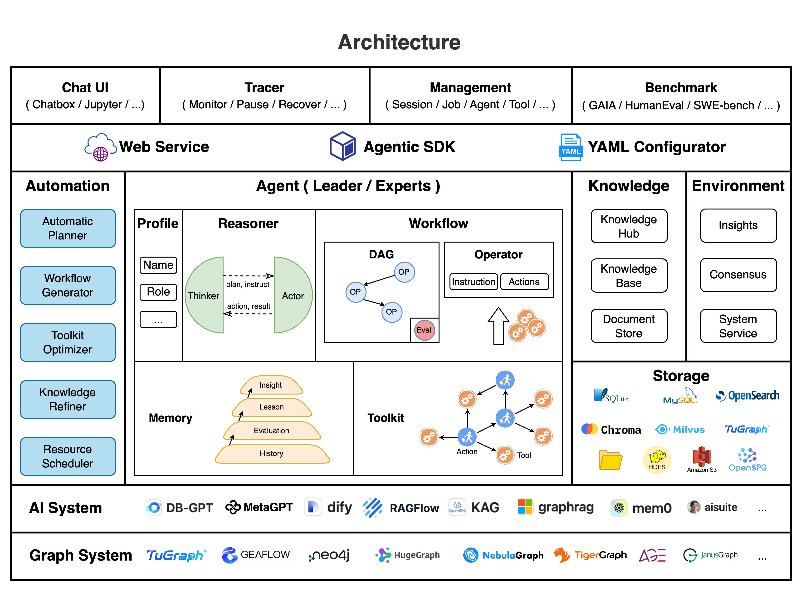

# Chat2Graph 架构

## 1. 逻辑架构图

Chat2Graph 采用分层设计的逻辑架构，从下到上分为数据层、引擎层、智能体层和交互层四个核心层次，形成一个**高内聚、低耦合**的图原生（Graph Native）系统。

**数据层**：作为整个系统的数据基础，支持多种图数据库（Neo4j、TuGraph）、数据库（SQLite）和向量数据库（Chroma）的无缝集成，为上层提供高性能的图和表存储和检索能力。同时集成多种数据源接口，支持结构化和非结构化数据的统一接入。

**引擎层**：系统的核心计算引擎，包含图计算引擎、推理引擎和知识引擎三大组件，包括，图计算引擎负责复杂图算法的执行和优化；推理（inference）引擎实现 LLM的快速接入和推理能力；知识引擎整合 VectorRAG 和 GraphRAG 技术，为智能体提供知识检索和推理能力。

**智能体层**：实现多智能体协作的核心层，采用单主动-多被动的混合架构设计。该架构包含 Leader（任务规划）、Expert（领域专家）两种类别的智能体，通过CoA式任务分解与图规划器实现复杂任务的自动化执行。

智能体借助工具图谱来调用工具，实现了对外界环境的感知和影响。此外，基于快&慢思考结合的双 LLM 推理机，实现了推理时规模化（Test Time Scalling），更长的推理链路，使得智能体在推理时成功调用工具的数量更多。

**交互层**：面向用户的服务接口层，提供多样化的交互方式。支持 SDK API 和 Web UI 两种主要使用形式，同时预留MCP、A2A等标准协议的扩展接口。

## 2. 核心能力

- 架构：单主动-多被动的混合架构。
- 推理：快&慢思考结合的双LLM推理机。
- 规划：CoA 式任务分解与图规划器。
- 记忆：分层记忆系统。
- 知识：支持 VectorRAG 和 GraphRAG。
- 工具：利用图结构组织工具和行动。
- SDK：智能体构建与服务API。
- 配置：一键配置智能体。
- 集成：支持 Neo4j 和 TuGraph 图数据库。
- 界面：支持 RestfulAPI 和 Web UI。
- 可干预：支持任务的暂停和恢复。
- 持久化：作业状态和消息的持久化。

## 3. 物理架构图

从自然语言输入到复杂图分析与知识发现的端到端问题，这是 Chat2Graph 所擅长解决的。下图物理架构展示了其核心模块的联系：用户以自然语言向 Chat2Graph 提出分析需求，例如“帮我分析《罗密欧》人物关系结构？”。Chat2Graph 接收此高级指令后，其内部的“多智能体系统”便被激活，启动一个相互协调的自动化流程。

Chat2Graph 能够将用户的高阶、自然语言指令，智能地转化为一系列精确、自动化的图构建、数据处理、算法应用和迭代优化的步骤。这极大地降低了用户进行复杂图分析的技术门槛，使得非技术背景的用户也能利用图的强大表达能力进行深度探索和知识发现：

Chat2Graph 特别适用于以下场景：

- **自然语言驱动的知识图谱构建与交互式探索**: 从海量文本、报告或各类数据源中自动构建领域知识图谱，并允许用户通过自然语言进行查询、分析与可视化。
- **复杂关系网络的深度分析**: 在社交网络分析、金融风控（如反欺诈、关联交易识别）、供应链优化、生物信息学（如蛋白质相互作用网络分析）、情报分析等领域，揭示实体间的深层联系、关键节点和社区结构。
- **智能问答与决策支持**: 基于动态构建和更新的知识图谱，提供上下文感知的高级问答服务，为复杂决策提供数据驱动的洞察。
- **自动化工作流构建**: 将涉及复杂流程自动化，我们将会在未来提供该功能。

让 Chat2Graph 成为连接自然语言与图智能的桥梁。

## 4. 开放的开源生态网络

- 接入开源 Agent 框架，比如 DB-GPT
- 接入开源大模型, 比如 Qwen、DeepSeek
- 接入开源工作流框架，比如 DB-GPT
- 接入开源图数据库，比如 TuGraph、Neo4j
- 支持 MCP、A2A（TODO）
- ……
