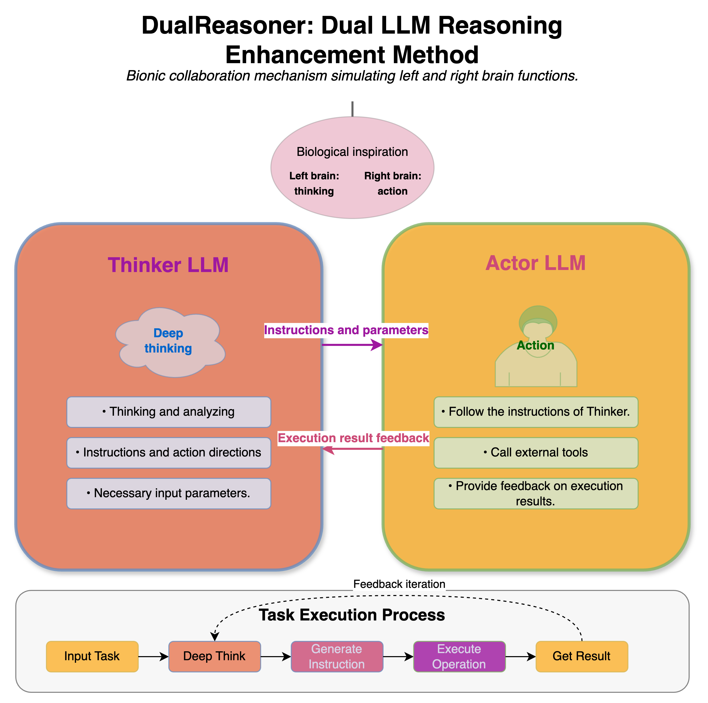

# Reasoner 模块

## 1. 推理机介绍

推理机（Reasoner）模块是 Chat2Graph 中与大型语言模型 (LLM) 交互的核心。其核心职责在于处理提示词、执行推理任务，并为 Agent 提供足够强大的工具调用能力。通过提供统一的 LLM 交互接口，Reasoner 封装了底层 LLM Client API，使得开发者能够专注于上层的开发。它支持（半）结构化输出、函数调用，和双（单）模型推理，因此提供了两种核心推理机的实现：`MonoModelReasoner` 和 `DualModelReasoner`，以适应不同场景下的需求。

## 2. 推理机设计

### 2.1. 模型服务

模型服务 (`ModelService`) 在 Chat2Graph 中扮演着与大型语言模型 (LLM) 交互的底层接口和实现层的角色。它封装了不同 LLM 平台（如 DB-GPT, AiSuite）的调用细节，并且支持所有 OpenAI API 兼容的模型（例如 Gemini、Qwen、DeepSeek 等，相关配置实例可见于 `.env.template` 文件）。

在工具调用方面，模型服务依赖特定的标签格式（如 `<function_call>...</function_call>`) 从 LLM 的输出中提取函数调用请求。此外，它还支持通过 `app.core.reasoner.injection_mapping` 定义的模块服务（例如 `GraphDbService`）作为工具调用时的参数，自动注入到目标工具中，从而增强了工具的灵活性和功能。

推理机通过通用的 `ModelService` 来调用大模型。

### 2.2. 单推理机 `MonoModelReasoner`

`MonoModelReasoner` (单模型推理机) 的工作方式依赖于单个 LLM 实例来完成所有智能处理阶段，包括理解用户指令、进行思考、选择必要的工具，并最终生成回复或执行动作。其主要优点在于配置简单直观，且由于所有处理步骤由同一模型完成，推理链路相对较短。然而，这种单一模型的架构在处理需要强大推理能力或复杂能力组合（如强大的通用理解与复杂的工具使用相结合）的任务时，往往会表现出性能不足。为了达到与 `DualModelReasoner` 相当的性能水平，`MonoModelReasoner` 一般需要依赖参数量更大的单一模型，这带来了成本与性能之间的权衡。因此，`MonoModelReasoner` 更适用于任务复杂度相对单一，或者所选用的 LLM 本身在各方面均表现优异且符合成本效益的场景。其整体性能完全取决于所选单一 LLM 的能力。

### 2.3. 双推理机 `DualModelReasoner`

`DualModelReasoner` (双模型推理机) 通常采用一个“思考型”（Thinker）LLM 和一个“执行型”（Actor）LLM 协同工作的模式。主模型（Thinker），通常是能力更强、理解和规划能力更出色的 LLM，负责理解复杂的用户意图、分解任务、制定计划，并在需要时决定调用哪个工具或子任务。随后，主模型将具体的、定义清晰的、步骤性的任务或工具调用请求传递给副模型（Actor）执行。副模型则是一个在特定方面（如遵循指令进行格式化输出、执行特定类型的函数调用、快速思考回答）更高效的 LLM。

这种双模型设计的核心优势在于任务专业化和增强的工具使用能力。它允许为特定子任务（如代码生成或自然语言对话）配置专门优化的角色 Prompt，从而提升整体效果。副模型可以专注于处理工具调用的请求和响应格式化，使得主模型能更集中于核心的推理和规划。相较于 `MonoModelReasoner`，`DualModelReasoner` 的潜力在于通过将任务智能地分配给不同角色的模型，以期达到整体更优的性能。例如，主模型处理复杂逻辑，而副模型快速处理格式固定的工具调用。

然而，`DualModelReasoner` 也存在一些挑战，主要包括配置复杂性的增加，因为需要为 Thinker 和 Actor 两个模型分别进行特定的 Prompt 设置。此外，两个模型之间的交互可能导致一定的推理延迟。因此，`DualModelReasoner` 特别适用于那些包含需要两个模型紧密合作的复杂任务，例如既需要强大规划能力又需要频繁、快速执行工具调用的场景。需要注意的是，如果模型间的协调不当，也可能引入额外开销或信息损耗（例如，一个模型误解另一个模型的指示），因此其实际性能表现需根据具体任务、所选模型及实现细节进行细致评估。

### 2.3 **推理机核心组件**

- `Reasoner`: 定义推理机的标准接口。
- `ModelService`: 封装与具体 LLM 服务端点交互的逻辑。

## 3. 使用示例

### 3.1. 模型服务调用 (`ModelService`)

- `ModelService` 调用 (涵盖基本响应与工具调用)
- **代码参考**:
  - 基本响应: `test/example/run_model_service.py`
  - 工具调用: `test/example/run_function_calling.py`

### 3.2. 单模型推理机调用 (`MonoModelReasoner`)

- `MonoModelReasoner` 调用 (涵盖通用推理与工具调用)
- **代码参考**:
  - 通用推理 (不带工具): `test/example/run_reasoner_without_func_calling.py` (配置为 `MonoModelReasoner`)
  - 工具调用 (带工具): `test/example/run_mono_reasoner_with_func_calling.py`

### 3.3. 双模型推理机调用 (`DualModelReasoner`)

- `DualModelReasoner` 调用 (涵盖通用推理与工具调用)
- **代码参考**:
  - 通用推理 (不带工具): `test/example/run_reasoner_without_func_calling.py` (配置为 `DualModelReasoner`)
  - 工具调用 (带工具): `test/example/run_dual_reasoner_with_func_calling.py`
