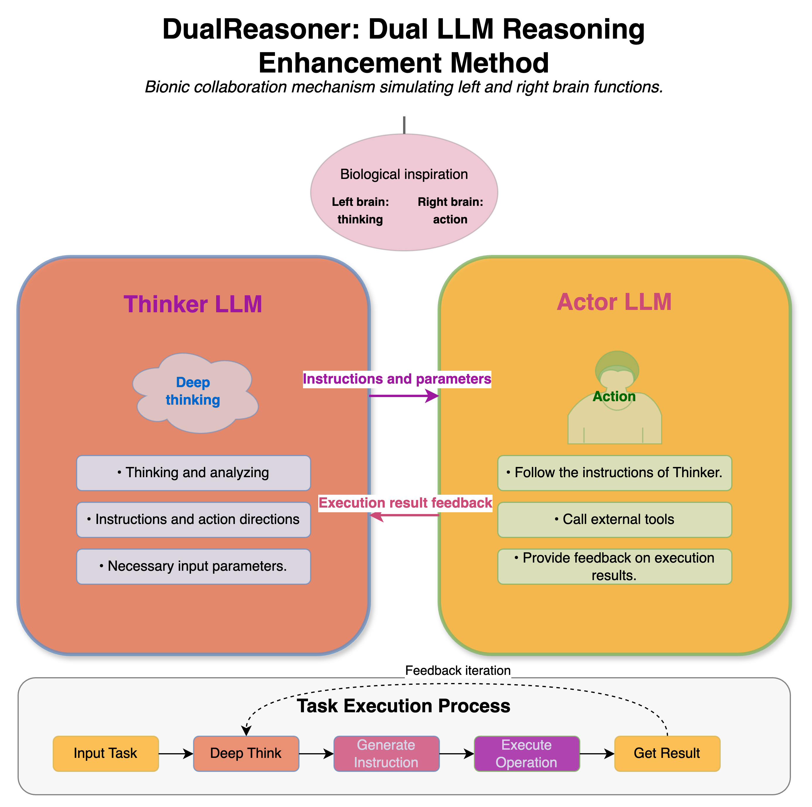

# Reasoner 模块

## 1. 推理机介绍

推理机（Reasoner）模块是 Chat2Graph 中与大型语言模型 (LLM) 交互的核心。其核心职责在于处理提示词、执行推理任务，并为 Agent 提供足够强大的工具调用能力。通过提供统一的 LLM 交互接口，Reasoner 封装了底层 LLM Client API，使得开发者能够专注于上层的开发。它支持（半）结构化输出、工具调用，和双（单）模型推理，因此提供了两种核心推理机的实现：`MonoModelReasoner` 和 `DualModelReasoner`，以适应不同场景下的需求。

## 2. 推理机设计

### 2.1. 模型服务

模型服务 (`ModelService`) 在 Chat2Graph 中扮演着与大型语言模型 (LLM) 交互的底层接口和实现层的角色。它封装了不同 LLM 平台（如 DB-GPT, AiSuite）的调用细节，并且支持所有 OpenAI API 兼容的模型（例如 Gemini、Qwen、DeepSeek 等，相关配置实例可见于 `.env.template` 文件）。

在工具调用方面，模型服务依赖特定的标签格式（如 `<function_call>...</function_call>`) 从 LLM 的输出中提取工具调用请求。此外，它还支持通过 `app.core.reasoner.injection_mapping` 定义的模块服务（例如 `GraphDbService`）作为工具调用时的参数，自动注入到目标工具中，从而增强了工具的灵活性和功能。工具调用的标准格式详见：`FUNC_CALLING_PROMPT`。

推理机通过通用的 `ModelService` 来调用大模型。

| 方法签名                                                                 | 描述                                                                                                                                                                                                                           |
| :------------------------------------------------------------------------------------------ | :---------------------------------------------------------------------------------------------------------------------------------------------------------------------------------------------------------------------------------------------- |
| `async generate(self, sys_prompt: str, messages: List[ModelMessage], tools: Optional[List[Tool]] = None) -> ModelMessage` | 这是与 LLM 进行交互的核心接口。子类必须实现此方法，以定义如何向底层 LLM 发送系统提示 (`sys_prompt`)、历史消息 (`messages`) 以及可选的可用工具列表 (`tools`)，并异步返回模型的响应 (`ModelMessage`)。                                                              |
| `async call_function(self, tools: List[Tool], model_response_text: str) -> Optional[List[FunctionCallResult]]`     | 此异步方法负责处理模型响应中可能包含的工具调用请求。它会解析 `model_response_text` 中的 `<function_call>` 标签，查找对应的工具函数，注入必要的服务依赖，执行函数，并返回包含所有调用结果（成功或失败）的 `FunctionCallResult` 列表。如果模型响应中没有有效的工具调用请求，则返回 `None`。 |

### 2.2. 单模推理机

`MonoModelReasoner` (单模推理机) 的工作方式依赖于单个 LLM 实例来完成所有任务处理阶段，包括理解用户指令、进行思考、选择必要的工具，并最终生成回复或执行动作。其主要优点在于配置简单直观，且由于所有处理步骤由同一模型完成，推理链路相对较简单和短。

然而，这种单一模型的架构在处理需要强大推理能力或复杂能力组合（如强大的通用理解与复杂的工具使用相结合）的任务时，往往会表现出性能不足。为了达到与 `DualModelReasoner` 相当的性能水平，`MonoModelReasoner` 一般需要依赖参数量更大的单一模型，这带来了成本与性能之间的权衡。

因此，`MonoModelReasoner` 更适用于任务复杂度相对单一，或者所选用的 LLM 本身在各方面均表现优异且符合成本效益的场景。其整体性能完全取决于所选单一 LLM 的能力。

#### 2.2.1. 单模推理机 Prompt

`MonoModelReasoner` 使用一个统一的 Prompt 模板（`MONO_PROMPT_TEMPLATE`）来指导 LLM 的行为。该模板旨在使单个 LLM 能够以一种“自给自足”的方式处理复杂任务，从理解、规划、执行，重复之前的步骤，到最终交付，形成一个完整的处理闭环。

单模推理机的 Prompt 的解析如下：

* **元认知框架**: 灵感来源于量子力学中的状态的转换。与 `DualModelReasoner` 中的 Thinker 类似，`MonoModelReasoner` 被要求使用元认知框架进行深度思考 (`<deep_thinking>`)。这包括利用思考状态（`<Basic State>`, `<Superposition State>`, `<Transition State>`和`<Field State>`）和思考模式标记来组织和展现其推理过程和深度。

* **集思考与行动一体 (`<deep_thinking>` & `<action>`)**:
  * `<deep_thinking>`: 此部分用于记录 LLM 的认知过程，要求其展示具体、果断、全面且直接的思考。
  * `<action>`: 在深度思考之后，`Reasoner` 在此部分执行具体的行动，这可能包括文本生成、分析或调用外部工具（函数）。Prompt 还明确了工具调用的格式 (`<function_call>...</function_call>`)。在工具调用之后，系统会提供调用的结果，`Reasoner` 可以基于这些结果（包括失败的调用）进行判断和后续的思考/修正。如果调用失败，`Reasoner` 应尝试纠正并重新调用。

* **终止条件与交付**:
  * 当 LLM 自行判断任务已解决时，必须使用 `TASK_DONE` 和 `<deliverable>` 标签来标记任务完成，并生成最终的交付物。

#### 2.2.2. 单模推理机 API

| 方法签名                             | 描述                                                                                                                                |
| :------------------------------------------------------ | :----------------------------------------------------------------------------------------------------------------------------------------------- |
| `async infer(self, task: Task) -> str`                  | 异步执行单模推理机的核心推理流程。接收 `Task` 对象，循环调用模型生成响应，处理工具调用，直到满足停止条件，最后通过 `conclude` 提取结果。                 |
| `async conclude(self, reasoner_memory: ReasonerMemory) -> str` | 异步方法，用于从 `ReasonerMemory` 中最后一条消息的载荷 (payload) 提取并格式化最终的推理结果。通常在 `infer` 方法内部被调用。                               |
| `static stopped(message: ModelMessage) -> bool`         | 静态方法，判断推理过程是否应该停止。检查 `ModelMessage` 的载荷中是否同时包含 `<deliverable>` 和 `</deliverable>` 标签。通常在 `infer` 方法内部被调用。 |

### 2.3. 双模推理机

`DualModelReasoner` (双模推理机) 通常采用一个“思考者”（Thinker）LLM 和一个“执行者”（Actor）LLM 协同工作的模式，类似于两个 LLM 在“一言一语”地交叉式地对话。主模型（Thinker），通常是能力更强、理解和规划能力更出色的 LLM，负责理解复杂的用户意图、分解任务、制定计划，并在需要时决定调用哪个工具或子任务。随后，主模型将具体的、定义清晰的、步骤性的任务或工具调用请求传递给副模型（Actor）执行。副模型则是一个在特定方面（如遵循指令进行格式化输出、执行特定类型的工具调用、快速思考回答）更高效的 LLM。

这种双模型设计的核心优势在于任务专业化和增强的工具使用能力。它允许为特定子任务（如代码生成或自然语言对话）配置专门优化的角色 Prompt，从而提升整体效果。副模型可以专注于处理工具调用的请求和响应格式化，使得主模型能更集中于核心的推理和规划。相较于 `MonoModelReasoner`，`DualModelReasoner` 的潜力在于通过将任务智能地分配给不同角色的模型，以期达到整体更优的性能。例如，主模型处理复杂逻辑，而副模型快速处理格式固定的工具调用。



#### 2.3.1. 双模推理机 Prompt

`DualModelReasoner` 的有效性，得益于其“特殊”的 prompt 配置，即，其核心在于分别为 "Thinker" 和 "Actor" 两个 LLM 配置了不同的 Prompt 模板，以引导它们分别承担不同的职责：让 Thinker 专注于复杂的规划和推理，而 Actor 则专注于高效、准确地执行任务和与外部工具交互。

* **Thinker Prompt**:
  * **角色定义**: 明确指示 LLM 扮演 "Thinker" 角色，负责深度思考、规划和生成指令。
  * **元认知框架**: Thinker 被要求使用元认知框架进行深度思考 (`<deep_thinking>`)，并通过认知状态和思考模式标记来展现其复杂的推理过程。
  * **指令生成**: Thinker 的主要输出是为 Actor 生成清晰、具体的指令 (`<instruction>`) 和必要的输入 (`<input>`)。
  * **工具调用结果评估**: Thinker 负责评估 Actor 的结果。如果 Actor 调用了工具，那么也会评估执行工具调用后返回的结果 (`<function_call_result>`)。基于此，Thinker 将进行下一步的规划和指令调整。
  * **对话管理**: 包含对话轮次限制、任务终止条件（`TASK_DONE`）等规则，确保任务高效推进。
  * **禁止行为**: Thinker 不应自己执行工具调用或生成最终的交付成果。

* **Actor Prompt**:
  * **角色定义**: 明确指示 LLM 扮演 "Actor" 角色，负责接收并执行 Thinker 的指令。
  * **指令与输入处理**: Actor 的核心任务是理解 Thinker 提供的 `<instruction>` 和 `<input>`，并据此行动。
  * **浅层思考 (`<shallow_thinking>`)**: Actor 进行的是相对“浅层”的思考，主要聚焦于如何准确执行当前指令，并解释其行动计划。
  * **动作执行 (`<action>`)**: Actor 在 `<action>` 部分执行具体操作，这可能包括生成文本、进行分析或调用工具（函数）。工具调用需严格遵循 `<function_call>...</function_call>` 格式。
  * **终止条件与交付**: 当 Thinker 发出 `TASK_DONE` 指令后，Actor 负责整合信息并生成最终的交付物 (`<deliverable>`)，其中包含任务目标、上下文、关键推理点和最终输出。

#### 2.3.2. 双模推理机 API

| 方法签名                             | 描述                                                                                                                                                             |
| :------------------------------------------------------ | :------------------------------------------------------------------------------------------------------------------------------------------------------------------------------ |
| `async infer(self, task: Task) -> str`                  | 异步执行双模推理机的核心推理流程，协调 Thinker 和 Actor LLM 的交互。接收 `Task` 对象，轮流调用 Thinker 和 Actor 模型，处理 Actor 的工具调用，直到满足停止条件，最后通过 `conclude` 提取结果。 <br> ```python <br> final_answer: str = await dual_reasoner.infer(task=task) <br>``` |
| `async conclude(self, reasoner_memory: ReasonerMemory) -> str` | 与 `MonoModelReasoner` 中的 `conclude` 方法功能和逻辑基本一致。异步方法，用于从 `ReasonerMemory` 中最后一条消息的载荷提取并格式化最终推理结果。通常在 `infer` 方法内部被调用。                               |
| `static stopped(message: ModelMessage) -> bool`         | 与 `MonoModelReasoner` 中的 `stopped` 方法功能和逻辑完全一致。静态方法，判断推理过程是否应停止，检查 Actor 的最新响应中是否包含 `<deliverable>` 标签。通常在 `infer` 方法内部被调用。                 |

## 3. 使用示例

* 模型服务调用 (`ModelService`)

  * 基本响应 (不带工具): `test/example/run_model_service.py`
  * 工具调用 (带工具): `test/example/run_function_calling.py`

* 单模推理机调用 (`MonoModelReasoner`)

  * 通用推理 (不带工具): `test/example/run_reasoner_without_func_calling.py` (配置为 `MonoModelReasoner`)
  * 工具调用 (带工具): `test/example/run_mono_reasoner_with_func_calling.py`

* 双模推理机调用 (`DualModelReasoner`)

  * 通用推理 (不带工具): `test/example/run_reasoner_without_func_calling.py` (配置为 `DualModelReasoner`)
  * 工具调用 (带工具): `test/example/run_dual_reasoner_with_func_calling.py`
