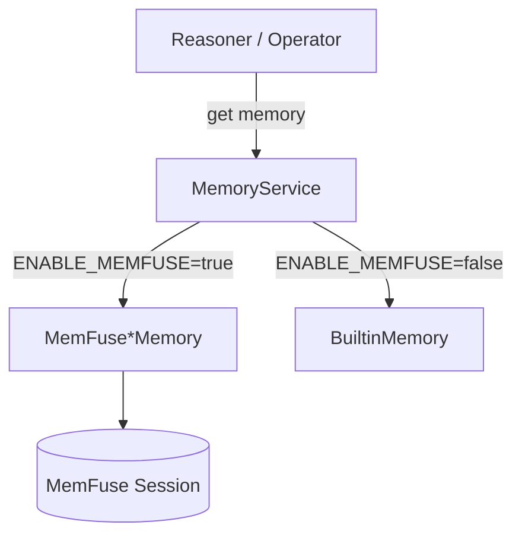
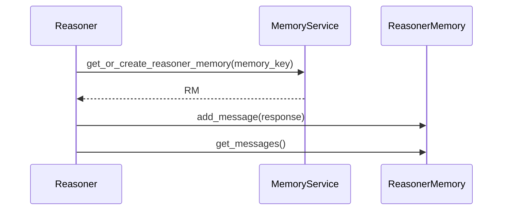
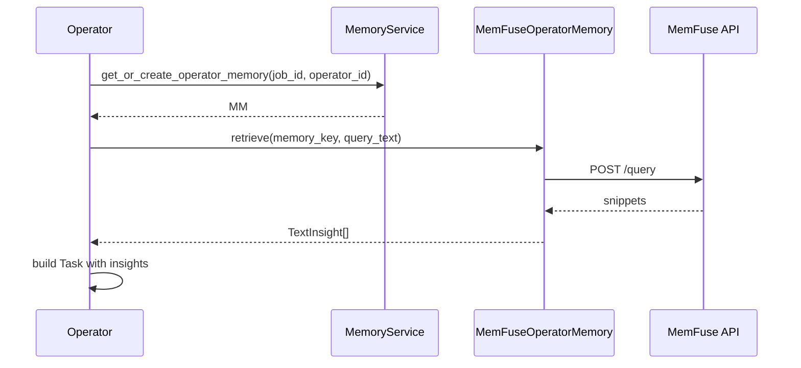
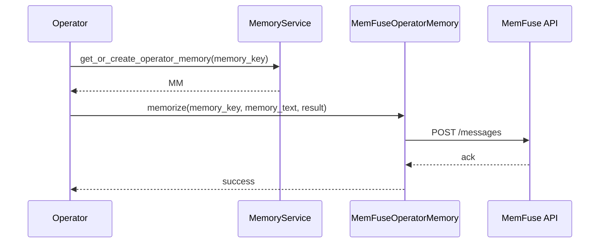

## 1. Introduction

The Memory system is the core component of Chat2Graph responsible for information storage, retrieval, and management. Through its multi-level memory system design, it defines the process of refining raw data into high-level wisdom insights, including memory storage, information evaluation, experience extraction, and insight generation. This provides persistent learning and adaptive capabilities for the entire Chat2Graph system, enhancing its overall intelligence.

> The functionality of the memory system is still under continuous development. This section focuses on the design philosophy, and we welcome interested contributors to join the community in building it together.

## 2. Design

### 2.1. Layered Memory Architecture

Inspired by the [DIKW](https://en.wikipedia.org/wiki/DIKW_pyramid) pyramid model, Chat2Graph abstracts memory into four hierarchical levels:

| Level | Name          | Description                                                                 | Storage Content                                      | Typical Use Cases                                     |
|:-----:|:--------------|:----------------------------------------------------------------------------|:-----------------------------------------------------|:------------------------------------------------------|
| **L0 (D)** | **History**   | Message History Layer                                                      | Reasoning messages, tool invocation records, system logs, etc. | Full traceability, debugging, basic retrieval         |
| **L1 (I)** | **Evaluation**| Process Evaluation Layer                                                   | Evaluation results, performance metrics, state classifications, etc. | Quality control, error diagnosis, pattern recognition |
| **L2 (K)** | **Lesson**    | Experience Summary Layer                                                   | Experience rules, best practices, domain knowledge, etc. | Decision support, strategy optimization, skill transfer |
| **L3 (W)** | **Insight**   | High-level Insight Layer                                        | High-level decision patterns, strategic insights, etc. | High-dimensional decision-making, user preferences, global optimization |

### 2.2. Hierarchical Knowledge Management

The content accessed at different memory levels varies significantly. For simplicity, we uniformly refer to it as "knowledge."

Traditional memory systems typically employ a single storage architecture, primarily addressing knowledge production and consumption. In contrast, the layered memory system introduces multi-level knowledge abstraction, managing knowledge at a finer granularity. Overall, it encompasses three aspects:

* **Knowledge Refinement**: Raw knowledge undergoes progressive processing, analysis, abstraction, and compression to form higher-level knowledge, expanding knowledge production capabilities.
* **Knowledge Drilling**: While using high-level knowledge, lower-level knowledge can be drilled down as needed, ensuring that reasoning contexts are both broad and detailed, strengthening knowledge consumption.
* **Knowledge Expansion**: Refers to the construction and recall of associations between knowledge at the same level, enriching the knowledge context through specific methods. A typical example is RAG (Retrieval-Augmented Generation).

## 3. Memory System Extension

Broadly speaking, the layered memory design allows the memory system itself, the Knowledge Base, and the Environment to follow one coherent architecture. Memory provides the common substrate, while knowledge bases and environments become specialized projections on top of it.

### 3.1. Knowledge Base

Generally, a knowledge base is viewed as a "closed" storage repository for external knowledge. To improve the quality of knowledge recall, most RAG frameworks focus on improving peripheral technologies around the knowledge base, such as query rewriting, document splitting, re-ranking, etc., while overlooking improvements to the knowledge content itself. GraphRAG can be seen as a relatively early attempt in this direction. The introduction of a layered memory system provides an "open" solution for fine-grained knowledge management.

Thus, in a sense, **"The Knowledge Base is a Specialized Expression of the Memory System in Vertical Domain Knowledge."** Currently, Chat2Graph initially implements RAG as the form of the knowledge base. Once the layered memory architecture is refined, the knowledge base will be further integrated. For details on using the knowledge base, refer to the [Knowledge Base](../cookbook/knowledgebase.md) documentation.

### 3.2. Environment

The environment refers to the external space with which an Agent interacts during execution. The agent can perceive environmental changes and influence environmental states through tool operations. Essentially, **"The Environment can be Viewed as 'External Memory at the Current Moment,' while Memory is 'Snapshots of the Environment at Historical Moments.'"** This homogeneity allows the environment to seamlessly integrate into the layered memory model. Environmental information perceived by the Agent through tools is essentially raw data at the L0 level, which can be further refined into higher-level insights (L1~L3). Conversely, accumulated experiences in the memory system directly effect global consensus and high-level insights in the environment. 

Using "tools" as a bridge, the memory system and environmental state can be deeply interconnected, constructing a mapping relationship between the agent's "mental world" and the external environment's "physical world"—the world knowledge model.

### 3.3. Memory

Chat2Graph integrates the layered memory philosophy into the runtime by combining an in-process `MemoryService` with extensible memory providers. The previous hook-based "enhanced" reasoner/operator wrappers have been removed—memory retrieval and persistence now happen inside the core execution path, which keeps the flow simpler and easier to observe.

#### 3.3.1. MemoryService orchestration

`MemoryService` is a singleton that owns two caches keyed by job and operator identifiers. At configuration time we decide which backend to use: when `ENABLE_MEMFUSE=true`, the service wires MemFuse-backed memories; otherwise it sticks with the builtin in-process memory. There is no runtime rollback—if MemFuse is enabled but misconfigured, initialization raises immediately.

Initialization of MemFuse clients happens lazily the first time a job/operator pair is encountered. This keeps the startup lightweight while ensuring subsequent retrieval and write calls reuse the same asynchronous MemFuse session managed by the plugin.

#### 3.3.2. Builtin memory

`BuiltinMemory` is the default in-process message store. It keeps the streaming conversation (L0 history) inside the application, supporting add, remove, upsert, and retrieval of the latest messages. No external dependencies are required, making it ideal for local development or minimalist deployments.

#### 3.3.3. MemFuse plugin

MemFuse support lives in `app/plugin/memfuse`. The plugin ships `MemFuseMemory`, a base class that centralizes the logic required to talk to the external MemFuse service:

* it creates the async MemFuse client using `MEMFUSE_BASE_URL`, `MEMFUSE_TIMEOUT`, and `MEMFUSE_API_KEY`.
* it exposes `_retrieve` and `_memorize` helpers that convert Chat2Graph messages into the OpenAI-style payload expected by MemFuse.
* it reuses the same event loop that performed the initialization, avoiding cross-thread pitfalls.

Because the module is packaged as a plugin, projects can swap or augment memory providers without modifying the core runtime.

#### 3.3.4. Reasoner memory

`MemFuseReasonerMemory` extends `MemFuseMemory` to manage the reasoner's conversational history. It stores all generation rounds and, when asked to retrieve, returns `Insight` objects that can be fed back into subsequent reasoning rounds. The builtin memory exposes the same interface (without external persistence), allowing the reasoner to work identically regardless of backend.

#### 3.3.5. Operator memory

`MemFuseOperatorMemory` focuses on cross-task knowledge sharing. During operator task construction, the operator queries the memory for relevant experiences without going through any external hook manager. The resulting insights are merged into the task before the reasoner starts generating. For environment configuration details (e.g., `ENABLE_MEMFUSE`, `MEMFUSE_BASE_URL`), see the [Configure .env guide](../deployment/config-env.md).

After the reasoner finishes, the operator composes a compact summary of the instruction, job goal, and execution result. This summary is persisted to whichever backend is active. No automatic downgrade occurs—if the plugin encounters an error the exception bubbles up to the caller.

