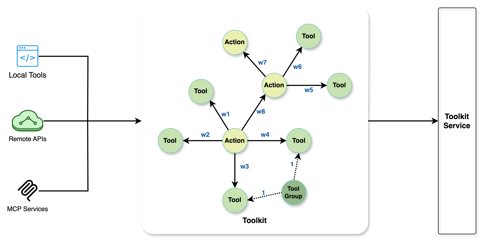
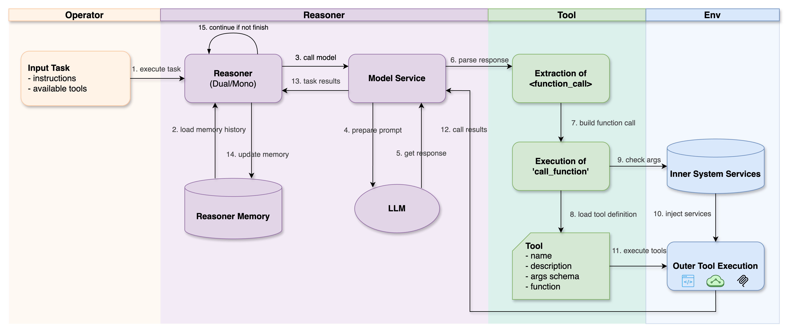
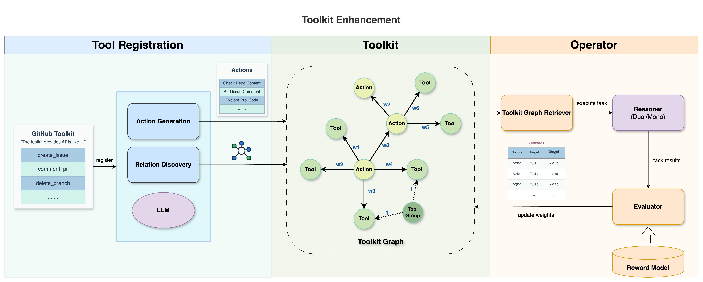

## 1. Introduction

The Toolkit module is one of the core components of Chat2Graph. Its primary responsibility is to recommend specific execution instructions and provide capabilities for interacting with the external world to the framework's `Operator`. It achieves this by meticulously managing a directed graph—the `Toolkit`—composed of "Actions", "Tools", and "ToolGroups". This graph not only defines the invocation relationships between different tools but also specifies their potential execution sequences, thereby expanding the operational capabilities of the `Operator`.

This module is dedicated to solving the challenges of tool invocation. It implements an advanced tool management mechanism: a directed graph of Actions, Tools, and ToolGroups that clearly describes the dependencies and transition relationships between tool calls, a significant improvement over a simple, traditional list of tools. Based on this graph structure, the system can more intelligently recommend contextually relevant tools and "Actions" to the Large Language Model (LLM), significantly improving recommendation accuracy. At the same time, the precision of the graph effectively constrains the LLM's tool selection, reducing uncertainty and the potential for errors. For developers, the Toolkit provides a unified mechanism for tool registration and recommendation, allowing `Tool` and `Action` objects to be easily reused, thus simplifying the development process. Furthermore, the module already supports the Model Context Protocol (`MCP`), and future enhancements will include offline learning capabilities to augment the `ToolkitService`'s recommendation abilities through reinforcement learning.

The main features of the Toolkit module include:
1. Support for defining and registering Tools and ToolGroups, compatible with the LLM's function-calling paradigm.
2. The ability to define Actions, where each action can contain a set of available tools and links to subsequent possible actions.
3. The core `Toolkit` component, which is responsible for the overall construction and management of the tool graph.
4. These functionalities are managed as a service through the `ToolkitService` and exposed via a convenient SDK interface, the `ToolkitWrapper`, for upper-layer applications.

The Toolkit is shared across the entire system, making its Actions and Tools reusable.

## 2. Design

### 2.1. **Tool Graph Design**

`Toolkit` organizes tools and actions using a directed graph structure. The primary nodes in the graph are `Action` nodes, each of which can be associated with a set of `Tool` nodes, representing the operations executable under that `Action`. Additionally, an `Action` points to subsequent possible `Action` nodes via its `next_action_ids` attribute. In the `Toolkit` graph, `Action` nodes are connected by weighted `Next` edges, indicating the sequential relationship and strength of association between actions. `Action` nodes are connected to their associated `Tool` nodes by weighted `Call` edges, representing the logical relationship and likelihood of the action invoking the tool. `ToolGroup` nodes serve as logical collections of `Tool`s and are connected to each of their contained `Tool`s via a `Group_Has_Tool` edge (with a fixed weight of 1), denoting an ownership relationship for easier management.

1. `Tool`: Represents a single, executable tool. Each tool includes its name, a description of its functionality, a JSON Schema definition of its input parameters, and its execution logic. In the Toolkit, a `Tool` is the basic execution unit invoked by an `Action`. Tools can be called by the `Reasoner`. Furthermore, the Toolkit supports dependency injection for services defined in `app.core.reasoner.injection_mapping` (e.g., `GraphDbService`), automatically providing them as parameters during tool invocation. This means you do not need to declare service module parameters in the docstring, as the `Reasoner` will automatically detect and inject the corresponding module, enhancing the tool's flexibility and power.

2.  `Action`: Represents a state or decision point for the LLM during task execution and is a core node in the `Toolkit` graph. The description of an `Action` helps the LLM understand its intent and function. An `Action` can be associated with one or more `Tool`s, indicating that these tools might be called when executing this `Action`.

3. `ToolGroup`: A logical collection of `Tool`s, typically representing an internal or external service (like an MCP server) or a set of functionally related tools. This facilitates the bulk registration and management of tools.

4. `Toolkit`: Responsible for organizing and managing the directed graph composed of multiple `Action`, `Tool`, and `ToolGroup` nodes. It is more than a simple collection of tools; it clearly expresses the invocation logic, organizational structure, and workflow of tasks.

5. `ToolkitService`: Manages the `Toolkit` instance and recommends appropriate `Action`s and `Tool`s to the LLM based on the current context.

  

This graph-based Toolkit mechanism offers significant advantages. First, it enables **context-aware tool recommendation**: the system can more accurately recommend available `Tool`s or the next possible `Action` based on the current `Action` node's position in the graph, which is far more intelligent and efficient than providing a flat, context-free list of tools. Second, the predefined graph structure **effectively narrows the search space** for the LLM when selecting tools or deciding on the next step, significantly reducing randomness and uncertainty, thereby improving the accuracy of tool calls and the overall efficiency of task execution. Finally, this structured approach makes modeling complex processes more natural and intuitive, allowing for the clear representation of multi-step, dependent, or conditional tool invocation flows.

### 2.2. **Toolkit Implementation**

1. **Initial Configuration**: The system predefines sets of `Action`s, `Tool`s, and `ToolGroup`s, as well as the `Action`s bound to an `Operator`, via YAML configuration. Tools for graph database operations are integrated as a built-in capability and can be registered simply through the [Graph Database](../cookbook/graphdb.md) service. Dynamic tool registration capabilities are currently under development.

2. **Tool Recommendation**: Based on the set of `Action`s bound to an `Operator`, the `ToolkitService` performs a graph traversal within the Toolkit. It finds other `Action`s and available `Tool`s associated with the current `Action` and provides them as recommendations. The scope of these recommendations (e.g., traversal depth or association strength) can be controlled by configuring thresholds and the number of hops for the graph traversal.

3. **Tool Invocation**: The `Reasoner` (often combined with the LLM's decision-making capabilities) selects the most appropriate `Tool` from the list of `Action`s and `Tool`s recommended by the `ToolkitService`. Once selected, the `Reasoner` executes the `Tool` and uses its result for subsequent task processing.

4. **Toolkit Enhancement**: The Toolkit's capabilities are continuously being optimized, with planned features such as one-click registration for toolsets and enhancements to the tool graph based on reinforcement learning.

### 2.3. **API**

#### 2.3.1. Toolkit API

The `Toolkit` class inherits from `Graph` and is specifically designed to build and manage the directed graph of `Action`s, `Tool`s, and `ToolGroup`s.

| Method Signature                                      | Description                                                                                                             |
| :--------------------------------------------------------------- |:---------------------------------------------------------------------------------------------------------------|
| `add_vertex(self, id, **properties) -> None`                     | Adds a vertex (`Action`, `Tool`, or `ToolGroup`) to the graph. The `properties` dictionary should contain a `data` key with the corresponding object as its value. The object is stored in the appropriate internal dictionary based on its type. |
| `vertices_data(self) -> List[Tuple[str, Dict[str, Union[Action, Tool, ToolGroup]]]]` | Retrieves all vertices and their associated data from the toolkit. Returns a list of tuples, where each tuple contains a vertex ID and a dictionary with its data. |
| `update(self, other: Graph) -> None`                             | Updates the current graph with vertices and edges from another `Toolkit` instance (`other`). New `Action`s, `Tool`s, `ToolGroup`s, or edges and their scores are added, while existing ones are not duplicated. |
| `subgraph(self, ids: List[str]) -> "Toolkit"`                    | Creates and returns a new `Toolkit` instance that is a subgraph of the original, containing only the specified vertex IDs and the edges between them. |
| `remove_vertex(self, id: str) -> None`                           | Removes a vertex from the graph, triggering a **one-way cascading delete**: 1. Deleting an `Action` removes any `Tool` that becomes orphaned (i.e., has no other `Action` connected to it). 2. Deleting a `ToolGroup` removes all `Tool`s it contains. 3. Deleting a `Tool` will also remove its parent `ToolGroup` if that `ToolGroup` is only connected to that single `Tool`. |
| `get_action(self, id: str) -> Optional[Action]`                  | Retrieves the `Action` object associated with a vertex ID. Returns `None` if the ID does not exist or does not correspond to an `Action`. |
| `get_tool(self, id: str) -> Optional[Tool]`                      | Retrieves the `Tool` object associated with a vertex ID. Returns `None` if the ID does not exist or does not correspond to a `Tool`. |
| `get_tool_group(self, id: str) -> Optional[ToolGroup]`           | Retrieves the `ToolGroup` object associated with a vertex ID. Returns `None` if the ID does not exist or does not correspond to a `ToolGroup`. |
| `get_score(self, u: str, v: str) -> float`                       | Gets the score of the edge connecting vertices `u` and `v`. Defaults to 1.0 if the edge does not exist. |
| `set_score(self, u: str, v: str, score: float) -> None`          | Sets the score for the edge connecting vertices `u` and `v`. |

#### 2.3.2. Toolkit Service API

`ToolkitService` is a singleton service that manages the `Toolkit` instance and provides functionalities for tool and action registration, recommendation, and visualization.

| Method Signature                                                                 | Description                                                                                                                                                                                 |
| :------------------------------------------------------------------------------------------ |:-----------------------------------------------------------------------------------------------------------------------------------------------------------------------------------|
| `get_toolkit(self) -> Toolkit`                                                              | Returns the `Toolkit` instance currently managed by the service. |
| `add_tool(self, tool: Tool, connected_actions: List[Tuple[Action, float]])`                 | Adds a `Tool` to the toolkit. `tool` is the tool object, and `connected_actions` is a list of `Action` objects that call this tool, along with their corresponding scores. A warning is printed if an `Action` is not in the graph or if the tool has no connecting `Action`s (in which case the tool is removed). |
| `add_tool_group(self, tool_group: ToolGroup, connected_actions: List[Tuple[Action, float]]) -> None` | Adds a `ToolGroup` and all of its contained tools. `tool_group` is the tool group object, and `connected_actions` is the list of `Action`s that call these tools, along with their scores. This method registers the `ToolGroup` node, then adds all its tools, creating both `ToolGroup`->`Tool` and `Action`->`Tool` connections. |
| `add_action(self, action: Action, next_actions: List[Tuple[Action, float]], prev_actions: List[Tuple[Action, float]]) -> None` | Adds an `Action` to the toolkit. `action` is the action object, while `next_actions` and `prev_actions` are lists of its subsequent and preceding `Action`s, respectively, along with their association scores. |
| `get_action(self, action_id: str) -> Action`                                                | Retrieves an `Action` object from the toolkit by its `action_id`. Throws a `ValueError` if not found. |
| `remove_tool(self, tool_id: str)`                                                           | Removes a `Tool` from the toolkit by its `tool_id`. |
| `remove_action(self, action_id: str)`                                                       | Removes an `Action` from the toolkit by its `action_id`. |
| `recommend_subgraph(self, actions: List[Action], threshold: float = 0.5, hops: int = 0) -> Toolkit` | The core recommendation method. Based on a list of input `Action`s, it performs a weighted Breadth-First Search (BFS) within a specified number of `hops` to find related `Action`s and their associated `Tool`s. Only relationships with scores greater than or equal to the `threshold` are included. Returns a `Toolkit` subgraph. |
| `recommend_tools_actions(self, actions: List[Action], threshold: float = 0.5, hops: int = 0) -> Tuple[List[Tool], List[Action]]` | Based on the result of `recommend_subgraph`, this method extracts the `Tool`s and `Action`s from the recommended subgraph and returns them as a tuple of lists. |
| `visualize(self, graph: Toolkit, title: str, show=False)`                                   | Visualizes the given `Toolkit` graph. `Action`, `Tool`, and `ToolGroup` nodes are displayed with different colors and shapes. Edges are also styled by type and labeled with their scores. `title` is the chart title, and `show` determines whether to display the image immediately. Returns a `matplotlib.pyplot.Figure` object. |

## 3. Examples

* Registering `Action`s, `Tool`s, and `ToolGroup`s with the `Toolkit`: `test/example/run_toolkit.py`
* Recommending `Action`s and `Tool`s to an `Operator` via `ToolkitService`: `test/example/run_operator.py`
* Integrating with a browser MCP: `test/example/mcp/run_playwright_mcp.py`
* Integrating with a local file system MCP: `test/example/mcp/run_file_system_mcp.py`
