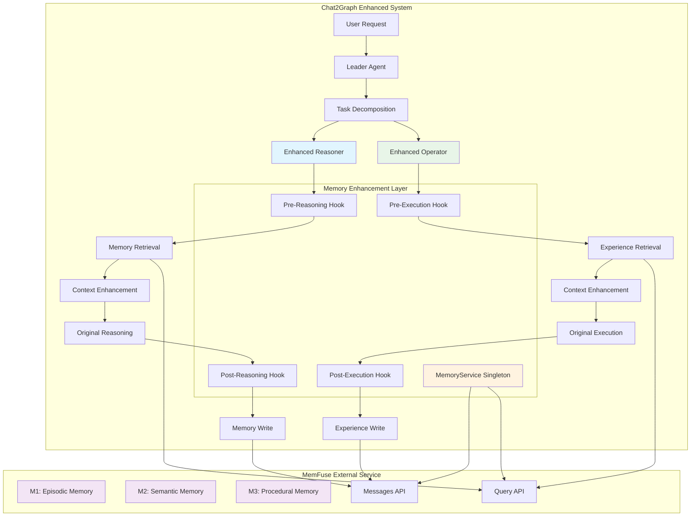
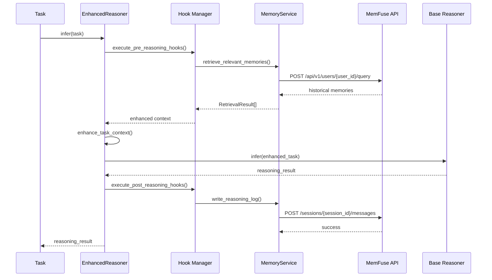
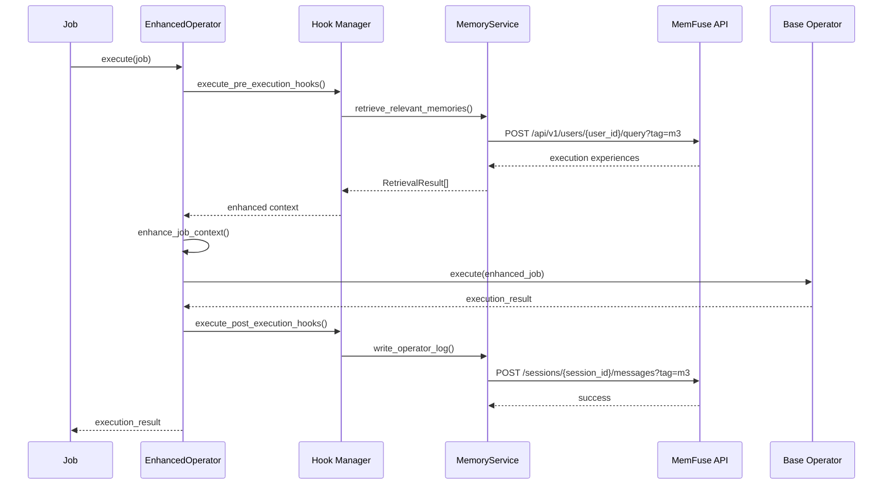

# `feat/216-memfuse-integration-old` Overview

This branch captures an earlier attempt to integrate MemFuse into Chat2Graph. While it is no longer functional, the intended architecture aligns with the current design and is preserved here for reference.

## System Architecture Flow

## Data Flow Diagram

### Reasoner Memory Enhancement Flow

### Operator Experience Learning Flow

### MemFuse Integration Notes

- **Memory Retrieval** uses `query` with no additional arguments.
- **Experience Retrieval** uses `query` with `metadata: {"task": "<some_task_name>"}`.
- **Reasoning Logs** use `add` with no extra metadata.
- **Operator Logs** use `add` with `metadata: {"task": "<some_task_name>"}`.

