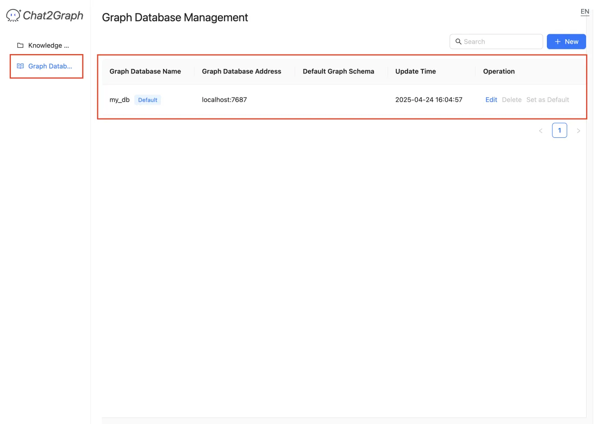

# Graph Database

Chat2Graph can interact with multiple graph databases and supports the management of the connections to them.

+ **Navigation:** Accessed via the "Graph Database Management" link in the manager's sidebar.
+ **Search Bar:** Allows filtering the list of databases by name or other criteria.
+ **New Button:** Opens a form or dialog to add a new graph database connection. This typically requires providing a name, the database address (e.g., `localhost:7687` for Neo4j), credentials, and potentially selecting a default schema.
+ **Database List:** Displays configured graph databases in a table format with the following columns:
    - **Graph Database Name:** The user-defined name for the connection (e.g., `my_db`). A "Default" tag indicates the database used by default for operations if not otherwise specified.
    - **Graph Database Address:** The network address and port of the database instance.
    - **Default Graph Schema:** (May show the name of the default schema associated with this connection, if applicable).
    - **Update Time:** The timestamp when the connection configuration was last modified.
    - **Operation:** Actions available for each database connection:
        * **Edit:** Modify the connection details.
        * **Delete:** Remove the database connection.
        * **Set as Default:** Mark this database connection as the default one to use.
+ **Please note** that in the conversation, if you want Chat2Graph to operate smoothly with the graph database, please ensure that a default graph database has been created.