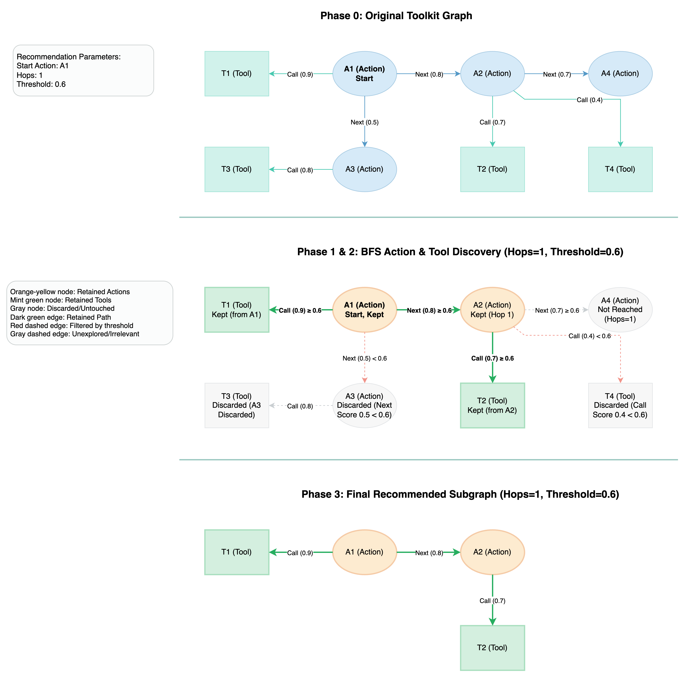

# Toolkit

## 1. 介绍

工具库（Toolkit）模块是 Chat2Graph 的核心组成部分之一，其主要职责是为框架中的 `Operator` 推荐具体执行指示以及与外部世界交互的能力。它通过精心管理一个由“行动” (`Action`) 和“工具” (`Tool`) 构成的有向图——即 `Toolkit` 来实现这一目标。这个图不仅精确地定义了不同工具之间的调用关系，还明确了它们之间潜在的执行顺序，从而拓宽了 `Operator` 执行的能力边界。

该模块致力于解决工具调用的问题。首先，它实现了高级的工具管理机制：通过一个包含 Action & Tool 的有向图，清晰地描述了工具调用间的依赖和转换关系，这远胜于传统的简单工具列表。基于这种图结构，系统能够更智能地向大型语言模型 (LLM) 推荐当前情境下可调用的工具及相关的“行动”，显著提高了推荐的准确率。同时，图的精确性有效约束了 LLM 选择工具的范围，从而降低了工具调用的不确定性和潜在的错误率。对于开发者而言，Toolkit 提供了统一的工具注册和推荐机制，使得工具 (Tool) 和行动 (Action) 可以方便地被复用，简化了开发流程。未来，该模块还将支持 MCP (模型上下文协议) 以及通过强化学习增强 `ToolkitService` 推荐能力的离线学习功能。

Toolkit 模块的主要功能点包括：
1. 支持工具 (`Tool`) 的定义与注册，并兼容 LLM 的函数调用模式。
2. 允许定义行动 (`Action`)，每个行动可以包含一组可用工具以及指向后续可能行动的链接。
3. 核心的工具集 (`Toolkit`) 组件负责工具库的整体构建和管理。
4. 这些功能通过 `ToolkitService` 进行服务化管理，并通过 `ToolkitWrapper` 提供便捷的 SDK 接口供上层应用调用。 

Toolkit 被整个系统所共享，因此，其中的行为和工具都是可复用的。

## 2. 设计

### 2.1. **工具图谱设计**

`Toolkit` 使用有向图图谱结构组织工具和行动。图中的节点主要是 `Action`，每个 `Action` 节点可以关联一组 `Tool`，代表在该 `Action` 下可执行的操作。同时，`Action` 通过其 `next_action_ids` 属性指向后续可能的 `Action` 节点。在 `Toolkit` 的这张图中，`Action` 之间通过**带权重**的 `Next` 边连接，表明了行为序列的顺序关系及其关联强度；而 `Action` 与其关联的 `Tool` 之间则通过**带权重**的 `Call` 边连接，表明了行为调用工具的逻辑关系及可能性。这种图结构清晰地定义了任务执行过程中的不同阶段（即 `Action`）、每个阶段可用的工具（即 `Tool`），以及它们之间潜在的转换路径，从而为任务执行提供了明确的流程引导。

1. `Tool` 代表一个独立的、可执行的工具。每个工具包含其名称、功能描述、输入参数的 JSON Schema 定义以及具体的执行逻辑。在 `Toolkit` 中，`Tool` 是被 `Action` 调用的基本执行单元。`Tool` 可以被 `Reasoner` 调用。此外，它还支持通过 `app.core.reasoner.injection_mapping` 定义的模块服务（例如 `GraphDbService`）作为工具调用时的参数，自动注入到目标工具中（即，你不需要在 docstring 中声明服务模块参数。因为 `Reasoner` 调用工具时会自动检测和导入对应模块），从而增强了工具的灵活性和功能。

2. `Action` 代表 LLM 在执行任务过程中的一个状态或决策点，是 `Toolkit` 图中的核心节点。`Action` 的描述信息有助于 LLM 理解其代表的意图和功能。一个 `Action` 可以关联一个或多个 `Tool`，表明执行该 `Action` 时可能需要调用这些工具。

3. `Toolkit` 负责组织和管理由多个 `Action` 和 `Tool` 节点构成的有向图。它不仅是工具的简单集合，更重要的是，它清晰地表达了工具间的调用逻辑和任务流程。在图中，`Action` 之间通过 `Next` 边连接，定义了行为的先后顺序；`Action` 与 `Tool` 之间通过 `Call` 边连接，定义了行为对工具的调用关系。

4. `ToolkitService` 负责管理 `Toolkit` 实例，并根据当前上下文向 LLM 推荐合适的 `Action` 和 `Tool`。

  

  这种基于图的 Toolkit 机制带来了显著优势。首先，它实现了上下文感知的工具推荐：系统能够根据当前所处的 `Action` 节点在图中的位置，更精确地向 LLM 推荐当前 `Action` 下可用的 `Tool` 或可能的下一个 `Action`，这远比提供一个扁平、无上下文关联的工具列表更为智能和高效。其次，通过预定义的图结构，`Toolkit` 有效地缩小了 LLM 在选择工具或决定下一步行动时的搜索空间，显著降低了选择的随意性和不确定性，从而提升了工具调用的准确性和任务执行的整体效率。最后，这种结构化的方法使得复杂流程的建模更为自然和直观，能够清晰地表达包含多个步骤、存在依赖关系或特定条件的复杂工具调用流程。

### 2.2. **工具库实现**

1. **初始配置**: 系统通过YAML配置预设的 `Action`，`Tool` 集合，以及 `Operator` 绑定的 `Action` 集合。其中图数据库的操作工具已作为内置能力集成到系统内部，只需要通过 [Graph DataBase](../cookbook/graphdb.md) 服务注册即可。另外，动态工具注册能力还在建设当中。

2. **工具推荐**: 基于 `Operator` 绑定的 `Action` 集合，`ToolkitService` 会在 Toolkit 中进行图上探索。它会查找与当前 `Action` 相关联的其他 `Action` 和可用的 `Tool`，并将它们作为推荐项提供出来。推荐的范围（例如，探索的深度或关联强度）可以通过配置阈值和图遍历的跳数来控制。

3. **工具调用**: `Reasoner` (通常结合 LLM 的决策能力) 从 `ToolkitService` 推荐的 `Action` 和 `Tool` 列表中选择最合适的 `Tool`。选定后，`Reasoner` 会执行该 `Tool` 并获取其执行结果，用于后续的任务处理。

    

4. **工具库优化**: 工具库的能力还在持续优化中，比如支持工具集的一键注册，以及基于强化学习思路的工具图谱优化等。

### 2.3. **API**

#### 2.3.1. 工具库 API

`Toolkit` 类继承自 `Graph`，专门用于构建和管理由 `Action` 和 `Tool` 构成的有向图。

| 方法签名                                      | 描述                                                                                                             |
| :--------------------------------------------------------------- |:---------------------------------------------------------------------------------------------------------------|
| `add_vertex(self, id, **properties) -> None`                     | 向图中添加一个顶点（`Action` 或 `Tool`）。`properties` 字典中应包含一个键为 `data` 的项，其值为 `Action` 或 `Tool` 对象。根据对象的类型，将其存储到对应的内部字典中。 |
| `vertices_data(self) -> List[Tuple[str, Dict[str, Union[Action, Tool]]]]` | 获取工具库中所有顶点及其关联数据（`Action` 或 `Tool` 对象）。返回一个元组列表，每个元组包含顶点 ID 和一个包含其数据的字典。                                       |
| `update(self, other: Graph) -> None`                             | 使用另一个 `Toolkit` 实例 (`other`) 中的顶点和边来更新当前图。如果顶点或边已存在，则不重复添加；如果 `other` 中包含新的 `Action`、`Tool` 或边及其分数，则将其添加到当前图中。 |
| `subgraph(self, ids: List[str]) -> "Toolkit"`                    | 根据提供的顶点 ID 列表 (`ids`) 创建并返回一个新的 `Toolkit` 实例，该实例是原图的一个子图，包含指定的顶点及其之间的边和关联数据。                                   |
| `remove_vertex(self, id: str) -> None`                           | 从图中移除一个顶点及其关联的 `Action` 或 `Tool` 对象。如果移除的是一个 `Action`，且该 `Action` 是其某个 `Tool` 后继节点的唯一前驱，则该 `Tool` 也会被一并移除。     |
| `get_action(self, id: str) -> Optional[Action]`                  | 根据顶点 ID 获取关联的 `Action` 对象。如果 ID 不存在或不对应 `Action`，则返回 `None`。                                                   |
| `get_tool(self, id: str) -> Optional[Tool]`                      | 根据顶点 ID 获取关联的 `Tool` 对象。如果 ID 不存在或不对应 `Tool`，则返回 `None`。                                                       |
| `get_score(self, u: str, v: str) -> float`                       | 获取连接顶点 `u` 和 `v` 的边的分数。如果边不存在，默认返回 1.0。                                                                        |
| `set_score(self, u: str, v: str, score: float) -> None`          | 设置连接顶点 `u` 和 `v` 的边的分数。                                                                                        |

#### 2.3.2. 工具库服务 API

`ToolkitService` 是一个单例服务，负责管理 `Toolkit` 实例，并提供工具和行为的注册、推荐及可视化功能。

| 方法签名                                                                 | 描述                                                                                                                                                                                 |
| :------------------------------------------------------------------------------------------ |:-----------------------------------------------------------------------------------------------------------------------------------------------------------------------------------|
| `get_toolkit(self) -> Toolkit`                                                              | 返回当前服务管理的 `Toolkit` 实例。                                                                                                                                                            |
| `add_tool(self, tool: Tool, connected_actions: List[Tuple[Action, float]])`                 | 向工具库中添加一个 `Tool`。`tool` 是要添加的工具对象，`connected_actions` 是一个列表，包含调用此工具的 `Action` 对象及其对应的分数（表示关联强度）。如果 `Action` 不存在于图中，会打印警告。如果工具没有任何 `Action` 连接，也会打印警告并移除该工具。                        |
| `add_action(self, action: Action, next_actions: List[Tuple[Action, float]], prev_actions: List[Tuple[Action, float]]) -> None` | 向工具库中添加一个 `Action`。`action` 是要添加的行为对象，`next_actions` 和 `prev_actions` 分别是此行为的后继和前驱 `Action` 列表及其关联分数。                                                                              |
| `get_action(self, id: str, action_id: str) -> Action`                                       | 根据 `action_id` 从工具库中获取 `Action` 对象。如果未找到，则抛出 `ValueError`。 (注意：参数 `id` 在当前实现中未使用)                                                                                                  |
| `remove_tool(self, id: str, tool_id: str)`                                                  | 根据 `tool_id` 从工具库中移除一个 `Tool`。 (注意：参数 `id` 在当前实现中未使用)                                                                                                                              |
| `remove_action(self, id: str, action_id: str)`                                              | 根据 `action_id` 从工具库中移除一个 `Action`。 (注意：参数 `id` 在当前实现中未使用)                                                                                                                          |
| `recommend_subgraph(self, actions: List[Action], threshold: float = 0.5, hops: int = 0) -> Toolkit` | 推荐引擎核心方法。基于输入的 `Action` 列表，通过带权重的广度优先搜索（BFS）在指定的 `hops` 范围内查找相关的 `Action`，然后关联这些 `Action` 调用的 `Tool`。所有关联关系的分数需大于等于 `threshold`。返回一个包含这些相关 `Action` 和 `Tool` 的子图 (`Toolkit`)。      |
| `recommend_tools_actions(self, actions: List[Action], threshold: float = 0.5, hops: int = 0) -> Tuple[List[Tool], List[Action]]` | 基于 `recommend_subgraph` 的结果，将推荐的子图中的 `Tool` 和 `Action` 分别提取出来，返回一个包含 `Tool` 列表和 `Action` 列表的元组。                                                                                    |
| `visualize(self, graph: Toolkit, title: str, show=False)`                                   | 将给定的 `Toolkit` 图 (`graph`) 可视化。`Action` 节点和 `Tool` 节点会以不同颜色和形状展示，边也会根据类型（Action-Action 或 Action-Tool）有所区分，并显示关联分数。`title` 为图表标题，`show`决定是否立即显示图像。返回 `matplotlib.pyplot.Figure` 对象。 |

## 3. 示例

* `Toolkit` 的 `Action` 和 `Tool` 注册：`test/example/run_toolkit.py` 的示例代码。
* `ToolkitService` 向 `Operator` 推荐 `Action` 和 `Tool`：`test/example/run_operator.py`
